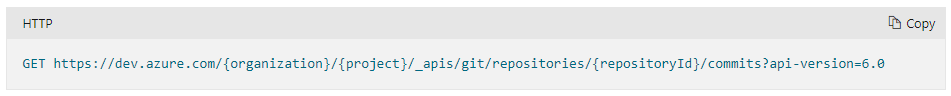

Using the [Azure DevOps API](https://docs.microsoft.com/en-us/rest/api/azure/devops/git/commits/get-commits?view=azure-devops-rest-6.0) you can programmatically get a list of commits from your repository with only a HTTP request.

 **Figure: HTTPS GET commits from your repository**

Using HTTPS with basic authentication, make a GET request to a URL as below, substituting in your project details. A JSON object will be returned. To quickly create classes from a JSON response, see the rule [Do you know how to easily get classes from a JSON response?](/do-you-know-how-to-easily-get-classes-from-a-json-response)

 **Figure: Using the Chrome extension Postman to execute our request with Basic Authentication**

For a C# implementation, see this blog post [Getting Git Commits with the VSO REST API](http://blog.damianbrady.com.au/2014/09/02/getting-git-commits-with-the-vso-rest-api/).
