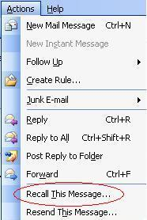
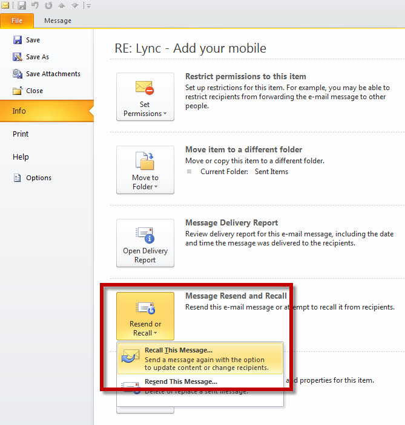

::: greybox
**Do you know it is better to send a v2 rather than recall the email, see SSW Rule [Do you know when and how to send a v2 of an email?](/email-send-a-v2)**
:::

Even though you may check your emails before sending, use SSW lookout to help you avoid mistakes, and even if you send/receive manually, there will still be times where you will send out an email with mistakes or incorrect content.

<!--endintro-->

But all is not lost.

### With Outlook 2007

If you go into your sent items, open up the offending email, and go into Actions | Recall this Message, outlook will attempt to delete the message from the recipient's inbox before he has a chance to read it.
**Figure: Actions | Recall this Message (Outlook 2007)**  

### With Outlook 2010

If you go into your sent items, open up the offending email, and go into file | Info | Resend Or Recall | Recall this message, outlook will attempt to delete the message from the recipient's inbox before he has a chance to read it.

 

Figure: File | Info | Resend Or Recall | Recall This Message (Outlook 2010)

Outlook will tell you whether it was successful or not
