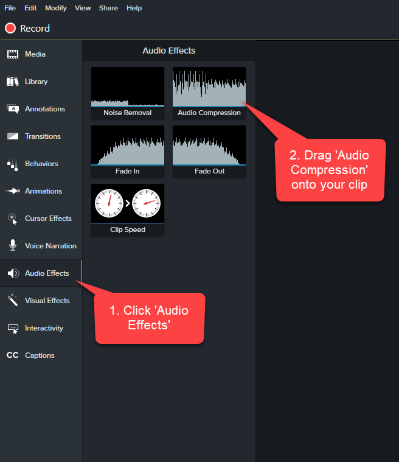
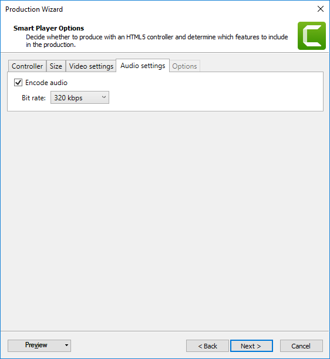

​When you've finished a PBI you should record a video to send to your Product Owner and anyone else that is interested. A 'Done' video is much better than a screenshot because you are proving the PBI workflow actually works. Even better, this video can double as documentation or release notes for your users.  

 <excerpt class='endintro'></excerpt> 

When deciding whether a PBI might be a good contender to record a done video for, consider these factors:
<ol><li>Is it a key piece of functionality that has high business value? </li><li>Would it be difficult to quickly demo in the Sprint Review without a video? </li><li>Is it UI heavy? i.e. would the video be compelling? </li></ol>
 
   ​ 
When deciding on the software: <ol><li>Solo "Done Video" – Camtasia </li><li>Remote person – Zoom or Teams (bitrate is low – the sound is not as good as Camtasia) </li><li>Edit the Video – Camtasia or Adobe Premiere Pro​ </li></ol> ​Here's a quick video describing how to record and edit a quick done video. (Notice how it itself is also in the done video format?)  

<iframe width="750" height="422" src="https://www.youtube.com/embed/CjwkGk1LcJ0" frameborder="0"></iframe>  

<strong>Figure: How to make a 'Done Video'</strong> 

 
   <b>
       </b>
   <strong></strong> 
   
 
      <b>
          </b>
      <strong></strong> 
      
 
         <b></b>

 
         <b>​​For a great 'Done Video' here are the key things to remember: </b> 
         
 
            <strong></strong> 
            <ul><li>Start with “Hi everyone, today I would like to show you xxxx” </li><li>Don't just demonstrate your new feature, start by showing the problem you are solving and the pain of why you needed to add the feature </li><li>Record it in one take. It doesn't matter if you stuff up or something goes wrong, treat it like you're having a conversation with them in the room. If it's super bad, just start again. </li><li>It's supposed to be quick and easy to make. If you spend too much time, you will be less likely to want to do it again in the future. </li><li>Be quick and concise, you don't want to waste other peoples' time either! </li><li>In your browser, remember to hide visible bookmark bars, browser tabs, add-in icons, and taskbar items to make it easier to view. 
                   See Rule: <a href="/_layouts/15/FIXUPREDIRECT.ASPX?WebId=3dfc0e07-e23a-4cbb-aac2-e778b71166a2&TermSetId=07da3ddf-0924-4cd2-a6d4-a4809ae20160&TermId=d6c8ec14-f604-490a-a96a-82315794cd6b" target="_blank" style="background-color:initial;">Do you make sure your screen recordings are easy to view?</a></li><li>In your browser, such as Chrome then you should first zoom to 125% ideally.​ 
                   ​See Rule: <a href="/_layouts/15/FIXUPREDIRECT.ASPX?WebId=3dfc0e07-e23a-4cbb-aac2-e778b71166a2&TermSetId=07da3ddf-0924-4cd2-a6d4-a4809ae20160&TermId=01b38f0f-597f-4410-84de-465a705aabea" target="_blank" style="background-color:initial;">Do you always zoom in when using a projector?</a> (or in this case before the recording a 'Done' video)</li><li>Set your screen resolution to 1080p (1920x1080). </li><li>Use Camtasia to record your screen and webcam (PC and Mac). For Mac you can use Quicktime but it’s not as flexible.  </li><li>Don't edit the video, Don't edit the video, just include your face at the beginning and end, using the fading functionality. <b style="background-color:initial;">Tip:</b> If you are using Zoom you do not need to edit the video. Zoom includes your face automatically in the screen capture. Awesome! </li><li>Do not use headphone and mic combo sets as these are not as good as your webcam's microphone </li><li> 
               <strong>Remember</strong>: smile at the beginning and end of the video! </li>

               <b></b>

               <b>​Tip: </b>Some offices have a professional setup. E.g. SSW have the 
               <b>Marantz Turret</b> hardware and desktop recording kit. The Turret is an ideal device to record these videos as it has a professional podcasting microphone, built-in light and good quality High Definition video camera.   
<dl class="image"><dt>
                  
               </dt><dd>Figure: 'Done' video in progress using a Marantz turret broadcasting kit</dd></dl> Learn more about the Turret: 
            <a href="https://wistia.com/learn/production/marantz-turret-review?wvideo=whmpjct7xj">Product Review: The Marantz Turret — Wistia</a>
            

<h3 class="ssw15-rteElement-H3">Camtasia - Let's look at an example by Ben Cull </h3>
E.g. SSW TimePRO - Power BI Ad-Hoc Reporting:

            <iframe width="750" height="422" src="https://www.youtube.com/embed/nG4IAxdEWQg" frameborder="0"></iframe> 
             
            
 
               <strong>Figure: A real example of a 'Done Video' with Fades</strong> 

​ 
<h3 class="ssw15-rteElement-H3">Tip: Fix the audio before making any cuts to the video </h3>
​After ​recording your video, you need to do some basic sound processing to make the audio awesome. 
<ul><li>In the Timeline, select the clip with the audio</li><li>On the top left panel, click ‘Audio Effects’ and drag the ‘Levelling’ effect onto your clip</li><li>On the timeline, move the new audio meter up just until the audio waveform is about to hit the top</li><li>Listen and adjust as necessary​ </li></ul><dl class="image"><dt>
                  
               </dt><dd>Figure: audio effects panel with the compressor </dd></dl><h3 class="ssw15-rteElement-H3">Tip: Camtasia 9 - How to fade-out and fade-in the video track of your face in Camtasia 9 </h3><ol><li>With the video track of your face selected, click on <strong>Animations (1)</strong>. Track 3 in the image below.</li><li>Select the <strong>No Opacity (2)  </strong>animation effect for the fade-out.</li><li> 
                  <strong>Drag and drop the No Opacity effect (3)</strong> to the point in the track where you want to fade-out. Adjust the start and end point of the fade using the handles on the animation arrow. </li><li>Select the <strong>Full Opacity (4) </strong>animation effect for fade-in. </li><li>
                  <strong>Drag and drop the Full Opacity effect (5) </strong> to the point in the track where you want to fade-in. Adjust the start  and end point of the fade using the handles on the animation arrow. </li></ol><dl class="image"><dt> 
                   
               </dt><dd>Figure: Camtasia - Steps for adding fade-out/fade-in animation to video track of your face in 'Done' video​​​​​​ </dd></dl><h3 class="ssw15-rteElement-H3"> Final Step – Export your video  ​</h3>

Follow the steps to export your video: 
<ol><li>Click the Share button on the top right of the window 
                     <dl class="image"><dt> 
                            
                        </dt></dl></li><li>In the new dialog, select custom production settings 
                     <dl class="image"><dt> 
                            
                        </dt></dl></li><li>In the next window, uncheck the ‘Produce with controller’ option 
                     <dl class="image"><dt> 
                            
                        </dt></dl></li><li>In the ‘Video settings’ tab, copy these settings: -	Frame Rate: 30 -	H.264 Profile: High -	Encoding mode: Quality     o	Increase the quality to 100% 
                     <dl class="image"><dt> 
                            
                        </dt><dd>Figure: Copy these settings</dd></dl></li><li>In the ‘Audio settings’ tab, make sure the Bit rate is set to 320 kbps 
                     <dl class="image"><dt> 
                           ​ </dt></dl></li><li>Click Next and save your file! </li></ol><h3 class="ssw15-rteElement-H3">Related rule </h3>
</ul>

<ul><li> 
         <a href="/_layouts/15/FIXUPREDIRECT.ASPX?WebId=3dfc0e07-e23a-4cbb-aac2-e778b71166a2&TermSetId=07da3ddf-0924-4cd2-a6d4-a4809ae20160&TermId=f5fc27ce-af9d-4b57-ad64-3893dacc09e3">​Communication - Do you send "Done Videos"?</a>​ </li></ul>

