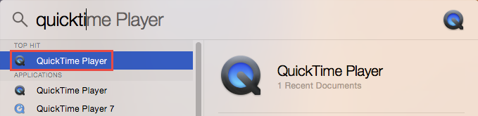
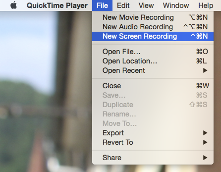
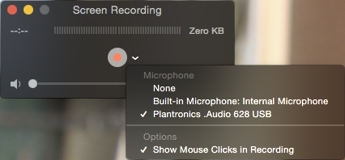

If you don't have Camtasia or ScreenFlow, you can use the built-in QuickTime Player to record the screen on Mac OSX.

<!--endintro-->

Open the QuickTime Player through the Applications folder, or by using search (Ctrl + Space) and typing QuickTime:

  

From QuickTime Player, you can start a new Screen Recording from the File menu:

  

In the Screen Recording window, you an select which microphone to use if you want to record audio:

  

**Tip:** Alternatively, you can use [Loom](https://www.useloom.com/) , which works as a Google Chrome extension.

### Related Rule 

* [Do you know how to start recording with Camtasia?](/production-do-you-know-how-to-start-recording-with-camtasia)
