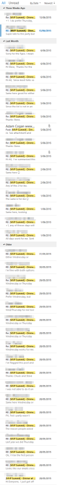
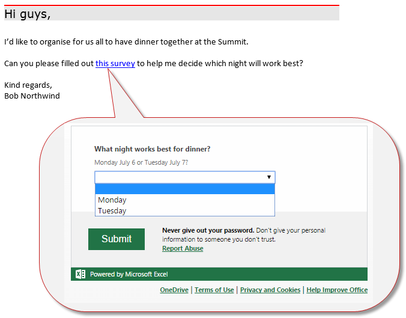

Reducing noise in email threads is easy now we have Office365 and OneDrive. 
 <excerpt class='endintro'></excerpt> 

Sometimes when organising or planning you will need to gather responses from a lot of people, but having many people reply to the email can create a long and messy thread. 

    

An easy alternative to this is to use Office365 in OneDrive to create a survey in Excel, and then send an email invitation with the link to your participants. They respond in the survey instead of by email, and the long, cluttered thread is avoided.

    

   
    

<dd class="ssw15-rteElement-FigureBad">​​Figure: Bad example – a simple “X or Y?” question thread generated dozens of responses that clogged up the inboxes of the recipients  </dd>

   
    

<dd class="ssw15-rteElement-FigureGood">​Figure: Good example – send an email with a link to a survey instead of asking for replies ​</dd>
​For a quick introduction to how to use Office365 from OneDrive, watch this video:  ​ 

<iframe width="560" height="315" src="https://www.youtube.com/embed/1D47IIIY87M" frameborder="0"></iframe>

