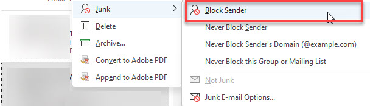

Spam. It wastes time and resources. In most cases, the amount of spam received by an organization far exceeds the amount of legitimate email.

e.g. Average volume of spam received daily

| Total Email Received | Spam | Legitimate | Spam % |
| -------------------- | ---- | ---------- | ------ |
| 2130                 | 1331 | 799        | 62     |

<!--endintro-->

 

From a SysAdmin point of view, using anti-spam protection is the best way to go to protect your company against spam, and, if you are using Exchange or Exchange Online, one of the best options for you is to use Microsoft's answer to this: [Microsoft 365 Defender](https://security.microsoft.com/)

There are also other non-Microsoft options e.g.

* GFI MailEssentials 
* Forcepoint Email Security

From an end-user point of view, when using Exchange and the Outlook client (or Outlook.com), Microsoft has a link with many options for you to take to block sender or mark email as junk:

* [Block senders or mark email as junk in Outlook.com](https://support.microsoft.com/en-us/office/block-senders-or-mark-email-as-junk-in-outlook-com-a3ece97b-82f8-4a5e-9ac3-e92fa6427ae4)

When on the Outlook desktop client, you should actively mark items as Junk and block their senders. Do the following:

1. Right click an unwanted email | Junk | Block Sender

::: good  

:::

Actively doimng this trains Microsoft 365 Defender to get better and better in combating spam and phishing over time.
