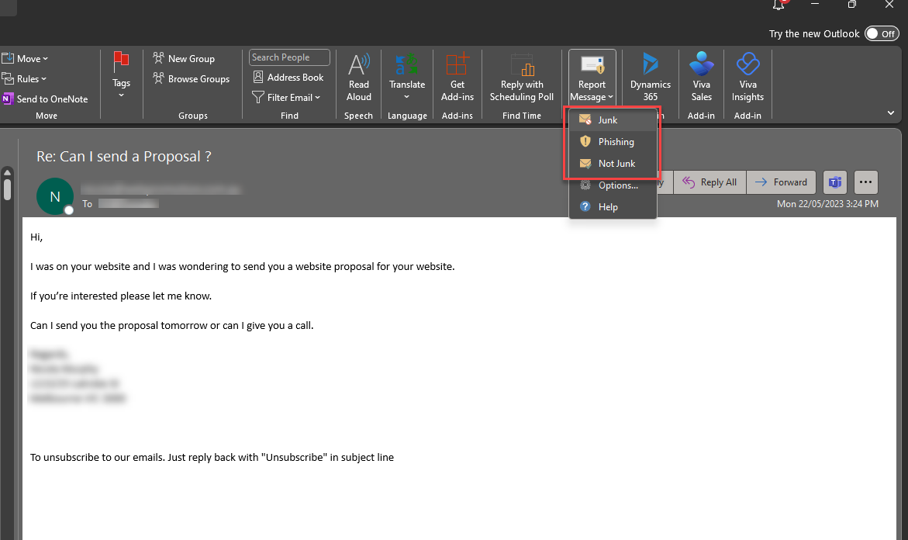
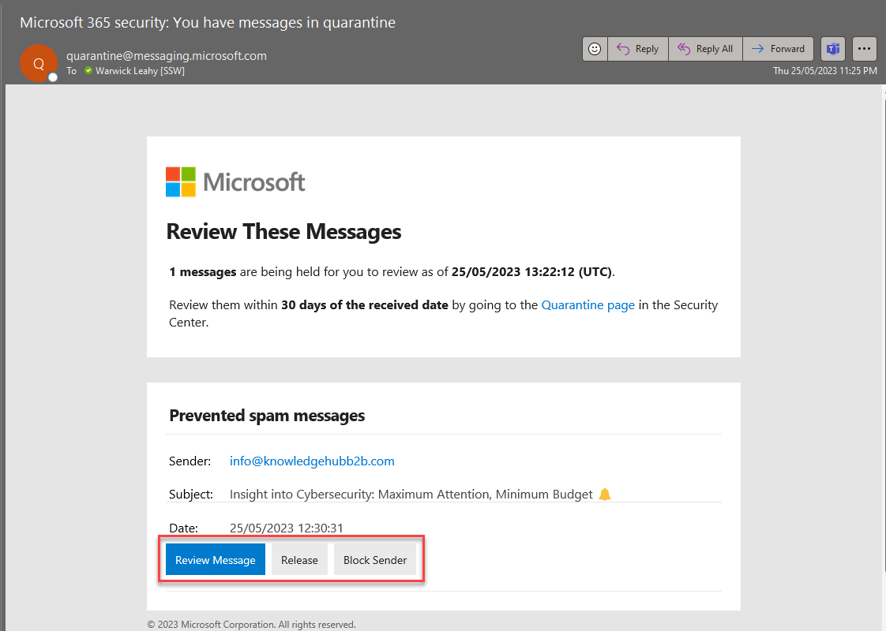
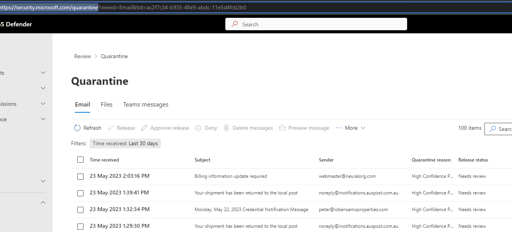

Spam. It wastes time and resources. In most cases, the amount of spam received by an organization far exceeds the amount of legitimate email.

E.g. Average volume of spam received daily:

| Total Email Received | Spam  | Phishing | Malware | Legitimate | Spam % |
| -------------------- | ----- | -------- | ------- | ---------- | ------ |
| 14539                | 12579 | 40       | 14      | 1906       | 86     |

<!--endintro-->

From a SysAdmin point of view, using anti-spam protection is the best way to go to protect your company against spam, and, if you are using Exchange or Exchange Online, one of the best options for you is to use Microsoft's answer to this: [Microsoft 365 Defender](https://security.microsoft.com)

There are also other non-Microsoft options e.g.

* Mimecast
* GFI MailEssentials 
* N-able Mail Assure

When using Exchange and the Outlook client (or Outlook.com), Microsoft has an addon "Report Message" which helps users to report spam and phishing emails (This can be deployed by an Admin to everyone in your company):

* [Mark email as junk or phishing](https://support.microsoft.com/en-us/office/use-the-report-message-add-in-b5caa9f1-cdf3-4443-af8c-ff724ea719d2)

When on the Outlook desktop client, you should actively mark items as Junk and block their senders. Do the following:

1. Select the email | Click "Report Message" | Choose "Phishing" or "Junk"

::: good

:::

Doing this sends a copy of the email for analysis to Microsoft Defender and helps to train the model that detects Junk mail and Phishing Scams.

From time to time you may also receive an email telling you about quarantined emails.

::: good

:::

::: info 
**Important - check very carefully and make sure you know the sender before releasing an email.  Otherwise you may end up releasing an email that you shouldn't.  If in doubt call your friendly SysAdmin who will help you to determine if it's safe to release.**
:::

::: good

:::
