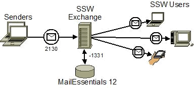
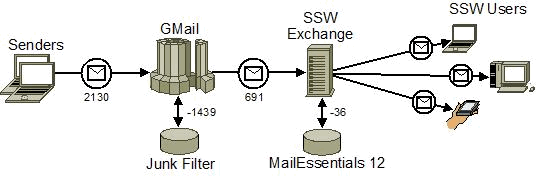
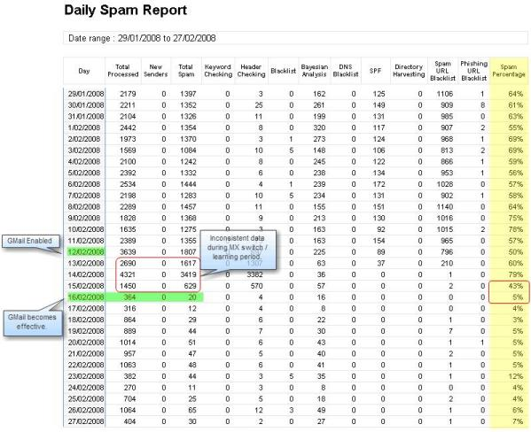

**Problem:** 
Spam. It wastes time and resources. In most cases, the amount of spam received by an organization far exceeds the amount of legitimate email.

e.g. Average volume of spam received daily at SSW

| Total Email Received  | Spam  | Legitimate  | Spam %  |
| --- | --- | --- | --- |
| 2130  | 1331  | 799  | 62  |

<!--endintro-->

**Options: 
** 
1. Software Spam Filters 
Microsoft Outlook Junk Filter 
GFI MailEssentials 
Red Earth Policy Patrol 
Websense Email Security

2. Hosted Spam Filters 
Google Apps Gmail (Free) 
Google Message Filtering 
Websense Hosted Email Security 
SpamSoap Core Filtering 
Microsoft Exchange Hosted Services

**Solution: 
** 
At present, all email is filtered at the local Exchange server by GFI MailEssentials 12. While it removes a large amount of spam, an unacceptable amount still reaches user inboxes. The current architecture is shown here. 

Figure: Previous email architecture.
GMail's basic service is the only free hosted solution, so it is naturally the first one to try. With Gmail as part of the solution the architecture changes to the following. The number of emails caught by each of the filters are averages. 

Figure: Current email architecture with GMail. 
 **Process: 

** The following steps need to be taken:

1. Register for a Google Apps Standard Edition account. Go to http://mail.google.com/mail/ and register with your domain name.

2. Setup a catch-all account in Gmail and enable POP3 access to it. This means that only one account will need to be checked to retrieve filtered mail.

3. Setup QSS Exchange Connector (http://www.quantumsoftware.com.au/) on your local Exchange server. This software bridges Gmail with Exchange. It logs into Gmail via POP3, retrieves the messages and then distributes them to users' individual accounts based on the header recipient fields.

4. Switch over your MX records to point to Google's servers. This takes around 24 hours to take effect. When the change fully propagates, email will be delivered to GMail and retrieved by Exchange Connector.

5. Monitor the GMail spam folder for false positives. Move false positives to Inbox. After approximately a week, GMail should have learnt enough to be left unmonitored. Emails can then be retrieved by user request.

**Results:
** 
The following report was generated by GFI MailEssentials 12. Note that the MX records changed over on 12/02/08. 

Figure: GFI spam statistics over the architecture change-over periods.

It can be seen that after the MX records changed over, there were a couple of days of unusual data. This was due to the MX record change over and filter learning period. 
By the 16th, only 20 emails were marked as spam by MailEssentials. It can also be seen that the percentage of overall spam dropped from as high at 78% to mostly single digit percentages. GMail was now catching the vast majority of spam.

It must be acknowledged that, while these figures do not represent the amount of spam actually reaching mailboxes, they do give a good indication of how effective Gmail's filters are.

From further investigation, it was found that info[at]ssw.com.au, which receives more spam than any other account, was now receiving around 5 unsolicited messages a week, as opposed to a hundred or more prior to GMail implementation. 
In the first two weeks after implementation GMail caught 23124 spam emails, an average of 1652 per day. 
Apart from the obvious benefits, this also saved 641 MB of bandwidth allowance. 
In the case of info[at]ssw.com.au, a modest calculation of time saved reviewing spam would be 10 hours per year. This estimate is based on an average of 25 emails per day and 4 seconds spent reviewing each one. Actual times will obviously fluctuate, as will the amount of spam other users receive.

**Possible Issues:**

A third-party has access to your email. 
False positives. The GMail filter is very accurate but it is possible legitimate emails will be caught. In the Standard (free) Edition of Google Apps, spam emails are only retained for 30 days before being permanently deleted. With Premier Edition (US$50 for one account for a year) you have 90 days with the inclusion of Postini message management. 
Inbound emails will be limited to 20MB per message. 
In the current stable release (3.5.9) of QSS Exchange Connector, mailing list emails from Yahoo Groups and the like are not correctly delivered to mailboxes when "Automatically detect recipients" is turned on. This has been addressed in beta release 3.6.0.2397 and should make it to a stable release soon. 
Using this method, all spam is delivered to one mailbox. This has the advantage that one person can easily review all spam. The disadvantage is that each user doesn't have easy access to his/her spam messages. If users do not personally their own messages, legitimate email is more likely to be lost. Google Message Filtering would be a solution to this issue.
