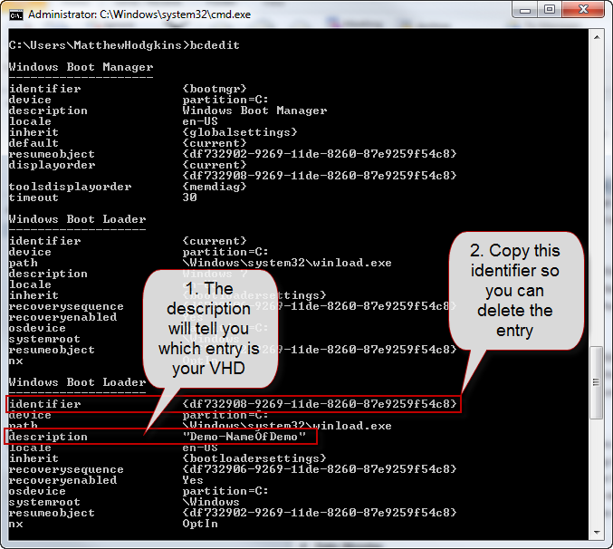
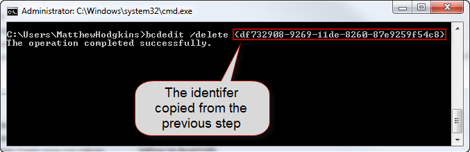

When you have finished with the VHD for the presentation you will want to remove the boot entries that were created for the VHD.  
<!--endintro-->

1. Open an administrative command prompt
2. View all the boot entries by typing: bcdedit 

Figure - The list Boot entries after running bcdedit 
    
3. Using the  **identifier** from the previous step you can now run the following command to delete the entry:
bcdedit /delete  <strong>{identifier}</strong> 

Figure - The boot entry has now been deleted

 You can now delete or move your VHD file and you will not get any errors when booting your laptop.
