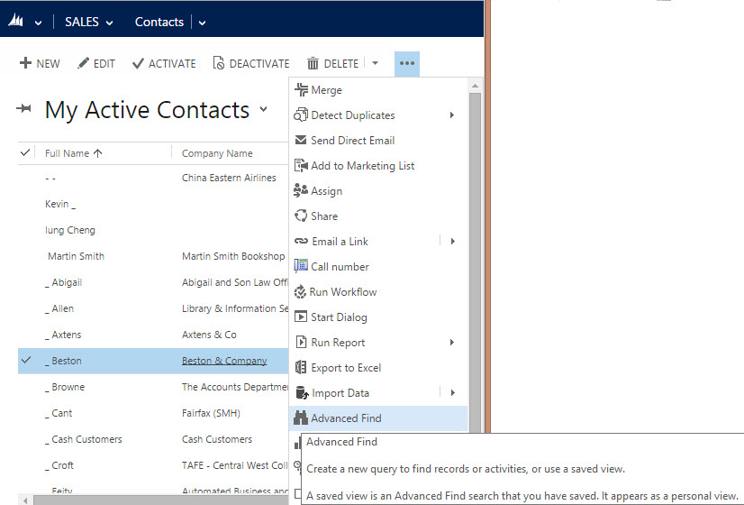
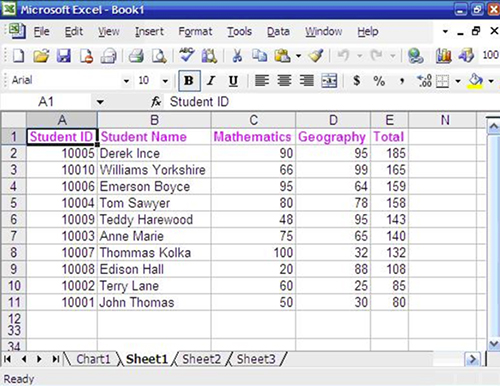
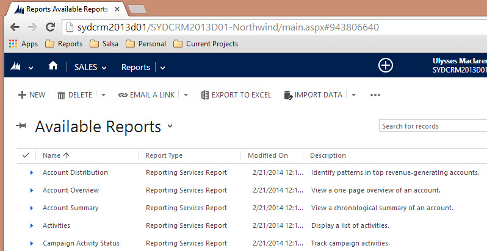

The data stored in CRM is useful on two counts. Firstly, it gives you a single source of truth for all customer related data. Secondly, you now have the ability to report on this data.

<!--endintro-->
<dl class="goodImage">   &lt;dt&gt; &lt;/dt&gt;&lt;dt&gt; <strong>Figure: Advanced find is the easiest way to filter your data in CRM</strong> &lt;/dt&gt;&lt;dt&gt; &lt;/dt&gt;&lt;dt&gt; 
       
   &lt;/dt&gt;  ::: good Figure: Good Example - You use Advanced Find | Export to Excel, but you’ll always have to re-create your reports each time you need the information. This is fine if you only need the information for a one off purpose like a quick mail out :::  </dl><dl class="goodImage">&lt;dt&gt; 
       
   &lt;/dt&gt;<dd>Figure: Better Example - The better way to do it is through CRM 2013 reports (built in SQL Reporting Services), as this gives you a reusable report you can come back to every time you need it</dd></dl>
