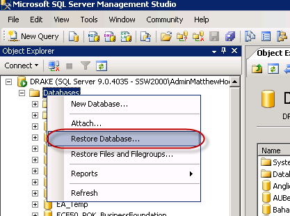

  
This is the meat of the migration process. First we need to detach the current content database from the Web Application:

<ol>
    <li>On the SharePoint 2010 server, open <b>SharePoint Central Administration </b>| <b>Application Management </b>| <b>Manage Content Databases</b> </li>
    <li>Set the <b>Database Status</b> to <b>offline </b>| tick <b>Remove content database</b> </li>
    <li>Open <b>SQL Server Management Studio</b> and delete the database you just removed from the web application </li>
</ol>

Now we need to attach the database backup we took of our SharePoint 2007 server:

 <excerpt class='endintro'></excerpt> 

  <ol>
    <li>In <b>SQL Server Management Studio</b> right click on <b>Databases</b> | <b>Restore Database… 
     
     
    <b><b>Figure 6 - Select “Restore Database”</b> 
    </b>
    <li>Follow the prompts to restore your database </li>
    </b></li>
    <li>Take the database out of read only mode (it will be in read only mode because we backed it up in read only mode) </li>
</ol>

Now we need to attach the content database to the web application:

<ol>
    <li>Open up the <b>SharePoint 2010 Management Shell</b> with administrative permissions. </li>
    <li>Run the following command to attach the database to the web application (replacing the red text to match your environment)
    
<b>stsadm –o addcontentdb –url </b><b>http://sp2010rc/</b><b> –databaseserver <DatabaseServerName> –databasename <ContentDatabaseName></b> 

    </li>
    <li>After the database has been restored you will get a status message telling you how the upgrade went, with the path to a log file. Send this file to the SharePoint developers to determine if any issues occurred during the migration </li>
</ol>

