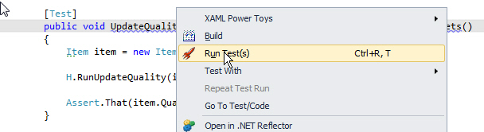

 <h3 class="ssw15-rteElement-H3">Option 1&#58; External tool (not recommended)​ </h3>
Using NUnit with Visual Studio&#58; To make it easy to use, you need to add it as an external tool in Visual Studio.

In Visual Studio&#58;
<ol><li>Go to Tools &gt; External Tools</li><li>Click &quot;Add&quot; button</li><li>Type in&#58;</li></ol><ul><li>Title&#58; NUnit GUI</li><li>Command&#58; Location of nUnit.exe file</li><li>Argument&#58; /run (so that the tests run automatically when started)</li><li>Initial Directory&#58; $(Target directory) </li></ul> 

<dl class="badImage"><dt>​</dt><dd>Figure&#58; Bad Example - NUnit In Visual Studio</dd></dl><h3 class="ssw15-rteElement-H3">Option 2&#58; Test Driven .net​​ </h3>
TestDriven.net has better NUnit integration – from both code and Solution Explorer windows.
<dl class="image"><dt></dt><dd>Figure&#58; Better way - Use TestDriven.Net - it has a 'Run Test(s)' command for a single test (above) or...</dd></dl><dl class="image"><dt></dt><dd>Figure&#58; ...you can right-click on a project and select 'Test With &gt; NUnit' to bring up the GUI. It is certainly more convenient</dd></dl>
​To run unit testing&#58; Tools &gt; NUnit GUI to launch NUnit and run the tests.
<h3 class="ssw15-rteElement-H3">Option 3&#58; Other Tools​ </h3>
Other Visual Studio tools including Resharper and Coderush have their own integration with NUnit. If you’re already using one of these, installing TestDriven.net is unnecessary. 

