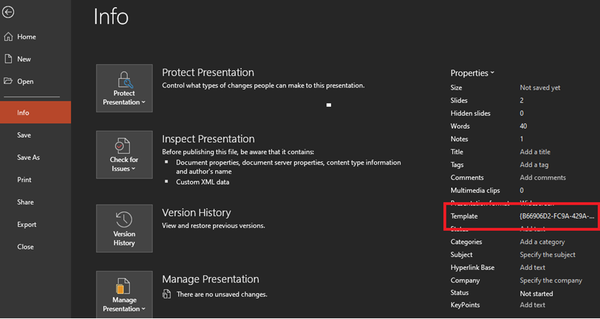
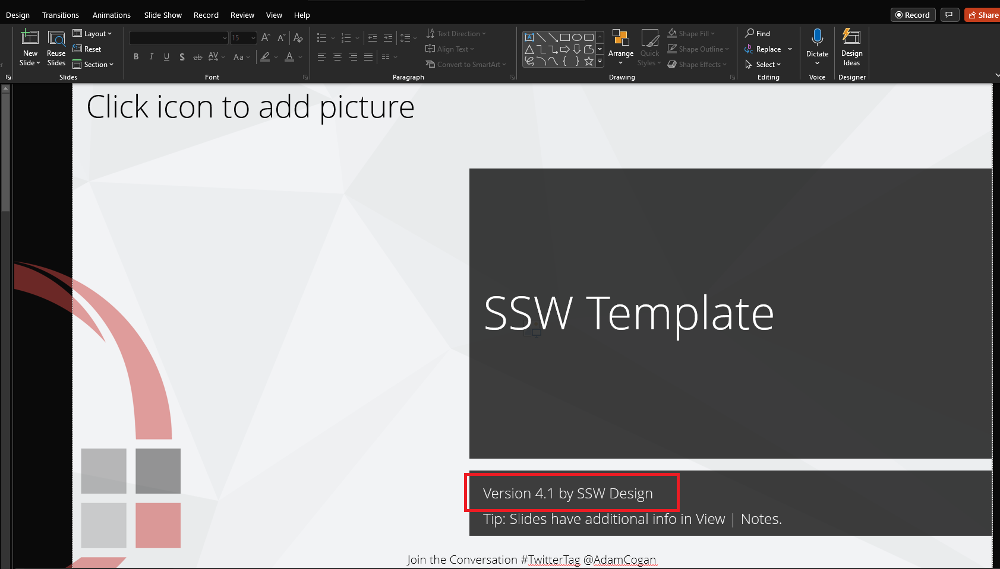

Unfortunately, there is no easy solution to this. What we need is a 'version' field and an 'Update' button - See our  **[Suggestions to Microsoft PowerPoint: Check for Updates](https://bettersoftwaresuggestions.com/microsoft/office/powerpoint/check-for-template-updates/)**

<!--endintro-->

We recommend to store the template version number on a slide on the PowerPoint template, which the presenter could remove.  

