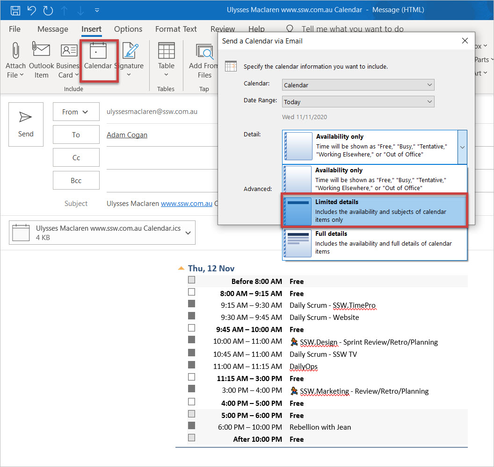

​Sometimes your schedule is chockers and you want to be transparent! 

​​Have you ever needed to send your calendar schedule to someone to figure out the best time to schedule a meeting with them? Figuring out when someone is available within your organization is usually ​easy, as Outlook can show you automatically using the Scheduling Assistant.  

If you're trying to coordinate with someone outside of your organization, this can be mo​re challenging. In Outlook you can easily include a copy of your calendar schedule to make this process easier. 

 <excerpt class='endintro'></excerpt> 

To insert a nice looking calendar and .ics file attachment into your email in Outlook, do the following:
<ol><li>New email in Outlook, go to the ribbon and select Insert / Calendar </li><li>​Select your options to insert the fancy HTML calendar and .ICS file in to the email:</li><li> You now have a nice looking calendar showing your availability, ready to send: <dl class="ssw15-rteElement-ImageArea"><strong>Figure: Pick​​ your cale​ndar, date range, and amount of detail</strong> </dl> </li></ol>
​ 

