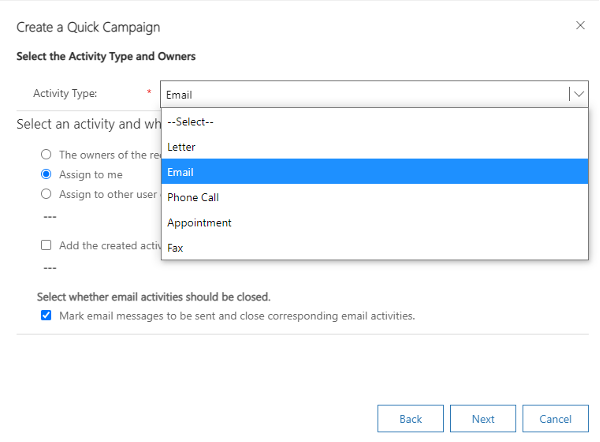

You can use mail merge template to send emails to various accounts and multiple contacts. In the following instructions, I am using a Quick Campaign to determine those whom I’m sending the email to:

<!--endintro-->

1.	Within Dynamics, click **Marketing Lists** in the left-hand column, and then click on the drop-down list at the top and select My active marketing lists   
  

2.	Click on the marketing list you want to send the email blast to 
  

3.	Select New Quick Campaign
  

4.	The Create Quick Campaign Wizard will then pop up, select **Next**

5.	Create a name for your Campaign

6.	Select Email as the Activity type
  

7.	Select **Assign to me**, and decide whether you want email activities to be closed after sending (usually, you will want to close them)

8.	Select “Use Template”, and click on the magnifying glass in the bar below
  

9.	Scroll through until you find the template you want to use
  

10.	Set the Priority to match the situation (urgent, normal etc.)

11.	The subject and body/content of the activity/email are already covered by the template you’ve chosen

12.	If you want to include it, the **Duration** is the anticipated number of minutes it will take the recipient to complete the activity or read the email. Select the appropriate timebox, if you so choose. Then, select **Next**

13.	Finally, select **Create**, and the Quick Campaign will initiate the activity, in this case sending an email (using the mail merge template) and send it out to everyone on the marketing list that you originally selected
