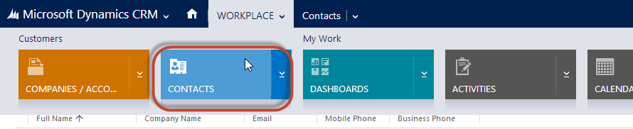
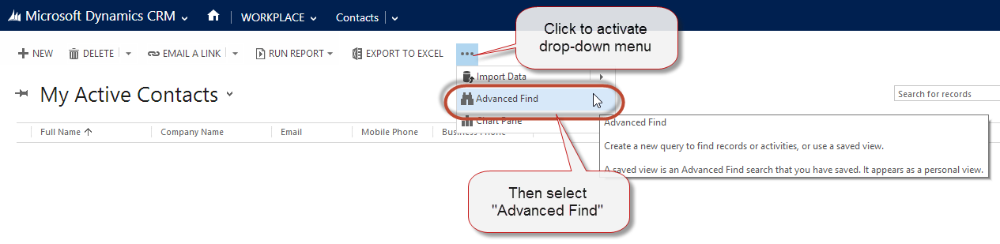
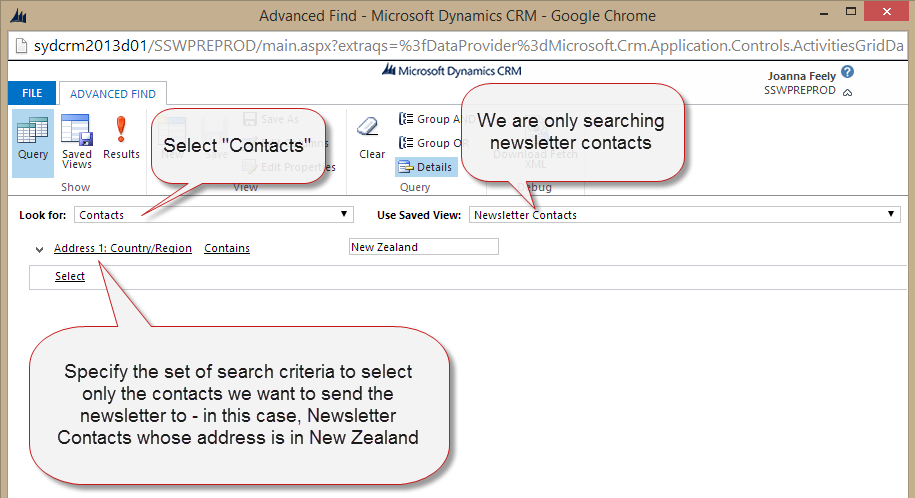

​​​Email newsletters can be sent and responses can be tracked using Microsoft Dynamic CRM 2013: 

 <excerpt class='endintro'></excerpt> 

There is more than one way to distribute a newsletter through CRM, such as through Campaigns and Quick Campaigns. The way detailed below is the simplest method, using Quick Campaigns. 
<ol><li>Find contacts that you will send the newsletters to. 
       The first time - use 
      <strong>Advanced Find</strong> in CRM 2013, then save it as a System View. In the example below, we're only interested in New Zealand contacts. Subsequent times - Use the <strong>System View</strong>, so everyone is using the same list. 
       </li><dl class="image"><dt> 
          
      </dt><dd>Figure: From the CRM home screen, hover your mouse over “Workplace”, and then click “Contacts” in the menu that drops down</dd></dl><dl class="image"><dt> 
          
      </dt><dd>Figure: From the “Activities” page, click “…” | “Advanced Find”. This will activate a pop-up.</dd></dl><dl class="image"><dt> 
          
      </dt><dd>Figure: Select Contacts at Look For and specify a set of criteria to search for newsletter contacts </dd></dl>
         <dl class="image"><dt> 
                
            </dt><dd>Figure: then select "Results" to bring up contacts which match your search query</dd></dl><dl class="image"><dt> 
                
            </dt><dd>Figure: The result contacts that will get newsletter: these contacts allow us to "Send Marketing Material" and have a New Zealand email address or living country is New Zealand </dd></dl><li>​First time only, save this as a System View. You will need a SysAdmin for this.</li><li>Create the newsletter in Microsoft CRM 2013 using a 
            <strong>Quick Campaign</strong>
            <dl class="image"><dt> 
                   
               </dt><dd>Figure: Select "For All Records on All Pages" to create a Quick Campaign from the current contact list. This will bring up a Quick Campaign Wizard </dd></dl></li><dl class="image"><dt> 
                
            </dt><dd>Figure: Click Next and then specify the name of the quick campaign.</dd></dl><dl class="image"><dt> 
                
            </dt><dd>Figure: Select the Activity Type and Owner.</dd></dl><dl class="image"><dt> 
                
            </dt><dd>Figure: Fill in newsletter content.</dd></dl>

            <strong>Attention: SSW Employees</strong> You need to follow the instructions in SSW Standards Internal for preparing the newsletter. It's a manual checklist so you don't make any mistakes. 
 ​ 
         
Use your preferred browser to view the content of the newsletter, select all (or use "Ctrl" + "A") and then copy and paste it in the Quick Campaign text area. 
<dl class="image"><dt> 
                
            </dt><dd>Figure: Highlight the keyword and click the Unsubscribe button to make a link for subscribers to unsubscribe themselves.</dd></dl><li>Click 
            <b>Next</b> to create all email activities in Microsoft CRM 2013.</li><li>Now you have to wait while the emails send out:
            <ul><li>
                  <b>Bad Example - Microsoft CRM Outlook</b> for outgoing email, then you need to open your Microsoft Outlook, so the email activities can be promoted to Outlook and sent out. This method is slow because of the synchronization process between CRM and Microsoft Outlook and you need to leave outlook open during the entire process.</li><li>
                  <b>Bad Example - Email router</b> for outgoing email, then those email activities will be sent out automatically by Email router. This method is our preferred method of sending the newsletter, CRM email router can be configured to send out newsletters immediately and the user doesn't have to open Outlook while the emails are being processed. ​As per Crm tip of the day (<a href="https://crmtipoftheday.com/979/start-planning-farewell-party-for-email-router/">https://crmtipoftheday.com/979/start-planning-farewell-party-for-email-router/ </a>) the email router is now deprecated </li><li>​<strong>Good Example - Server side sync </strong> for outgoing email, then those email activities will be sent out automatically by server side sync. This method is our preferred method of sending the newsletter, CRM Server side sync can be configured to send out newsletters immediately and the user doesn't have to open Outlook while the emails are being processed. </li></ul></li></ol>

