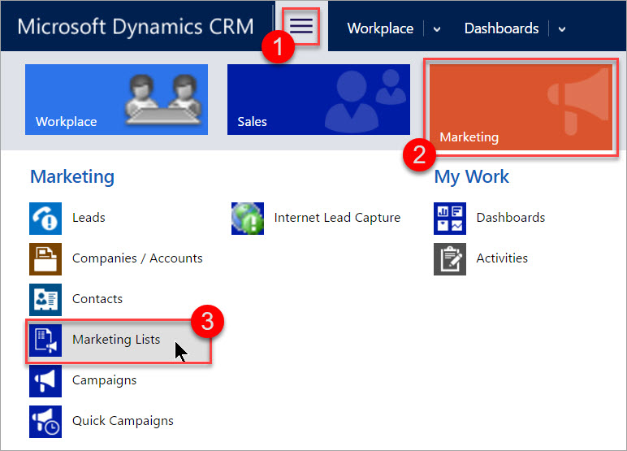
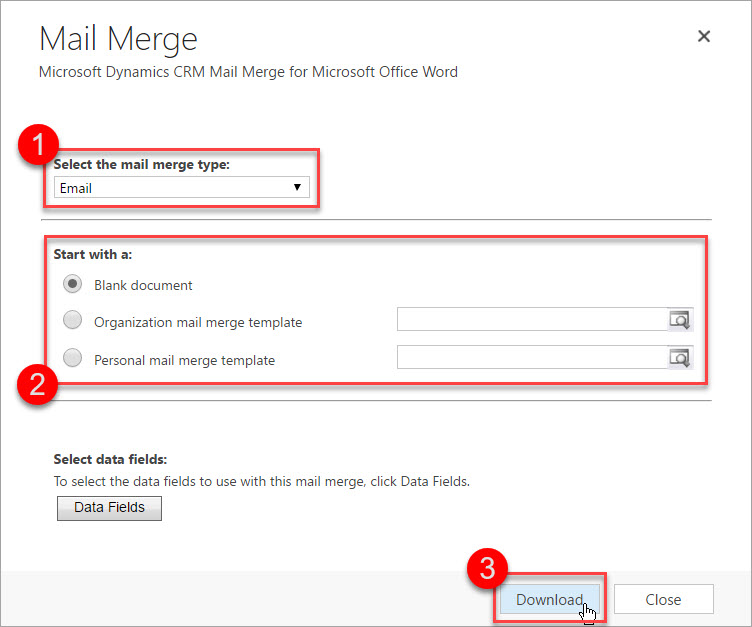
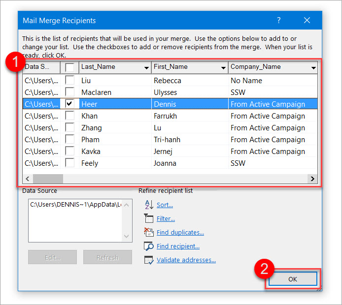
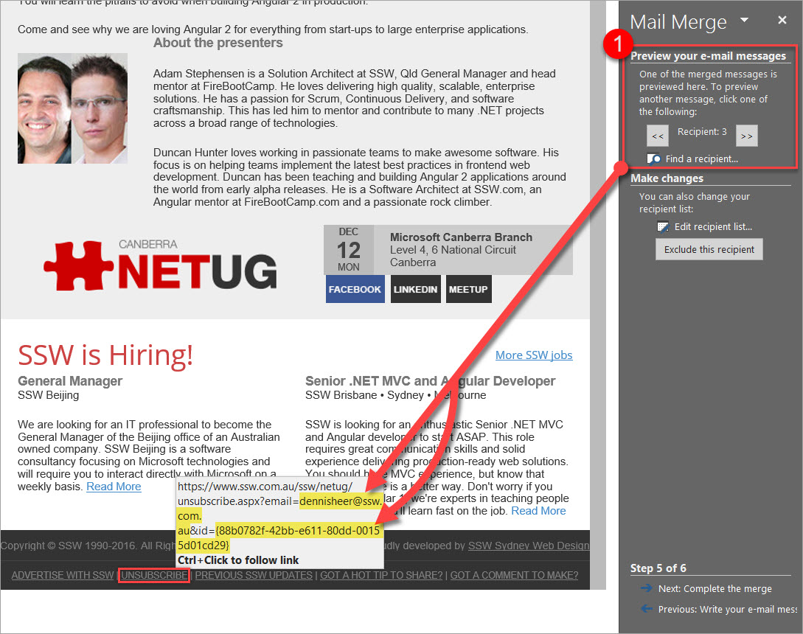

There are different ways of sending newsletters using the Microsoft Dynamics CRM 2016:

* Campaigns
* Quick Campaigns
* Mail Merge on Marketing Lists

This rule will show you how to send a newsletter using the last method, the mail merge.

By default, Microsoft Dynamics CRM 2016 does not come with good functionality on inserting custom unsubscribe links to your newsletters - that's why we are going to look at how to add a custom unsubscribe link in each email. 

<!--endintro-->

Prerequisites:

* [Microsoft Dynamics CRM 2016 for Microsoft Office Outlook (Outlook client)](https://www.microsoft.com/en-au/download/details.aspx?id=50370) is installed and set up
* Microsoft Outlook is running and set up

### Option 1 (recommended)

Basic coding knowledge (VBA) required - you will have to configure the macro that generates and inserts your custom unsubscribe link. If you don't feel comfortable doing this, have a look at Option 2 below.

Depending on how many contacts you are going to send the newsletter to, you should think about setting up a VM or using an external provider for sending the emails.

1.   Go to   **Main | Marketing | Marketing Lists**
<dl class="image">&lt;dt&gt; &lt;/dt&gt;<dd> Figure: This is where you can find your Marketing Lists in Microsoft Dynamics CRM 2016</dd></dl>
2.   Open the Marketing List you want to send the newsletter to by clicking on it (you should be using a dynamic list)

3.   Go to  **... | Mail Merge on List Members** (in the menu bar)
<dl class="image">&lt;dt&gt;&lt;/dt&gt;<dd> Figure: Click the ellipsis button to reveal the Mail Merge option</dd></dl>
4.   Select Email as the mail merge type, choose your starting document, (optional) select data fields to use, and download the .docx

<dl class="image">&lt;dt&gt;&lt;/dt&gt;<dd> Figure: This is an example of a configuration to start with</dd></dl>
5.   Open the document in Word and follow the instructions in the document to start the Mail Merge

<dl class="image">&lt;dt&gt;&lt;/dt&gt;<dd>Figure: Follow these steps to start working on the mail merge</dd></dl>
6.   Exclude contacts and press  **OK**
<dl class="image">&lt;dt&gt;&lt;/dt&gt;<dd> Figure: Choose the recipients for your mail merge and proceed</dd></dl>
7.   Copy and paste your newsletter from Internet Explorer to Word (IE because it seems to not break the style)

For a nicer editing experience (especially with HTML newsletter), switch to the Web Layout view by clicking  **View | (Views) | Web Layout** in the ribbon bar.

8.   If necessary, go to  **File | (Info) | Convert** to update the Word document to the newest version - this will solve styling issues while not breaking the mail merge
<dl class="image">&lt;dt&gt;&lt;/dt&gt;<dd>Figure: Convert the mail merge document to the newest version </dd></dl>
9.   Modify and run the following macro to replace the word "UNSUBSCRIBE" in the newsletter with a custom hyperlink.

For help on adding a macro to Word see the [Microsoft Office Support website](https://support.office.com/en-us/article/Create-or-run-a-macro-c6b99036-905c-49a6-818a-dfb98b7c3c9c).

Sub InsertNewsletterLink()
'
' InsertNewsletterLink Macro
'
'
'Finds and adds a hyperlink where the UNSUBSCRIBE tag is placed
    With Selection.Find
        .Forward = False
        .Wrap = wdFindAsk
        .Text = "UNSUBSCRIBE"
        .MatchWholeWord = True
        .Execute
    End With
    ActiveDocument.Fields.Add Range:=Selection.Range, Type:=wdFieldHyperlink

'Switch to alternative view so we can modify the content of the hyperlink "manually"
    ActiveDocument.ActiveWindow.View.ShowFieldCodes = \_
     Not ActiveDocument.ActiveWindow.View.ShowFieldCodes
 
    With Selection.Find
        .Forward = True
        .Wrap = wdFindStop
        .Text = "HYPERLINK"
        .MatchWholeWord = True
        .Execute
    End With

    Selection.InsertAfter " ""https://www.ssw.com.au/ssw/NETUG/Unsubscribe.aspx?email=<<email>>"          'Insert word mail merge fields on <<email>> and <<contact>>          With Selection.Find         .Forward = False         .Wrap = wdFindStop         .Text = "<<email>>"         .MatchWholeWord = True         .Execute     End With          ActiveDocument.Fields.Add Range:=Selection.Range, Type:=wdFieldMergeField, Text:="EMAIL"          Selection.InsertAfter "&id=<<contact>>"          With Selection.Find         .Forward = False         .Wrap = wdFindStop         .Text = "<<contact>>"         .MatchWholeWord = True         .Execute     End With          ActiveDocument.Fields.Add Range:=Selection.Range, Type:=wdFieldMergeField, Text:="CONTACT"     Selection.InsertAfter """"          Selection.MoveRight Unit:=wdCharacter, Count:=1      'Remove the additional MERGEFORMATs      For counter = 0 To 1     With Selection.Find         .Forward = False         .Wrap = wdFindStop         .Text = "\* MERGEFORMAT "         .MatchWholeWord = True         .Execute     End With     Selection.Delete     Next counter      'Switch back to normal view so we can change what the hyperlink looks like to the user     ActiveDocument.ActiveWindow.View.ShowFieldCodes = _      Not ActiveDocument.ActiveWindow.View.ShowFieldCodes           With Selection.Find         .Forward = True         .Wrap = wdFindStop         .Text = "Error! Hyperlink reference not valid."         .MatchWholeWord = True         .Execute     End With     Selection.Text = "UNSUBSCRIBE"     Selection.Font.Bold = False          Selection.Font.Underline = wdUnderlineSingle                  Selection.HomeKey Unit:=wdStory           End Sub </contact></contact></email></contact></email></email>

10.   Follow the steps in the mail merge sidebar on the right-hand side of Word

> If you are using mail merge fields, like the contact names, you should preview your message for some contacts. 

 

11.   Send the mail merge newsletter to the email address property of every contact by selecting the following
<dl class="image">&lt;dt&gt; &lt;/dt&gt;<dd>Figure:  Example configuration for the email that is about to be sent </dd></dl>
### Option 2

You don't need any coding knowledge here - but this means you will have to generate your custom unsubscribe link manually and copy and paste it into the mail merge document. Make sure to [set it up it correctly](https://support.microsoft.com/en-us/kb/912679) before copying.

`youtube: https://www.youtube.com/embed/0VVuIRelIDw?rel=0`
 

::: good
Figure: Good example - send your newsletter like this

:::
