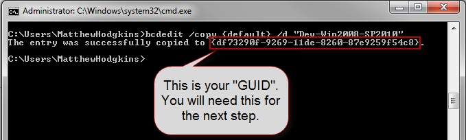
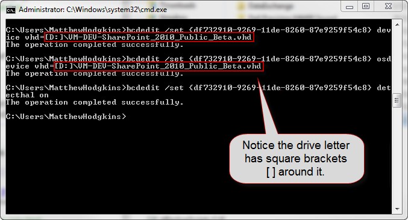

Using Boot to VHD is very similar to dual-booting your machine, except that you do not have to partition your hard drive. It also has performance benefits over using a Hyper-V server for presentations.   
<!--endintro-->
**Pre-Requisites** 

* The presentation computer running Windows
* A SysPreped VHD image to be deployed onto the presentation computer

1. Copy a SysPreped VHD image to the laptop to be used for the presentation.
2. Open an Administrative command prompt.
3. Type:
bcdedit /copy {default} /d “Demo-NameOfDemo”

Figure - Creating the entry using BCDEdit shows your GUID
4. Type:
bcdedit /set <guid>  <strong>device</strong> vhd=[D:]\VM-DEV-SharePoint_2010_Public_Beta.vhd</guid>
**D:\** is the drive the VHD is located and  **VM-DEV-SharePoint\_2010\_Public\_Beta.vhd** is the location of your VHD file. Make sure you replace   with the GUID you got in the previous step.
5. Type:
bcdedit /set <guid>  <strong>osdevice</strong> vhd=[D:]\VM-DEV-SharePoint_2010_Public_Beta.vhd</guid>
**D:\** is the drive the VHD is located and  **VM-DEV-SharePoint\_2010\_Public\_Beta.vhd** is the location of your VHD file. Make sure you replace   with the GUID you got in the previous step.
6. Type:
bcdedit /set <guid> detecthal on</guid>

Figure - Each time you run a BCDEdit command it should return "The operation completed successfully"
7. Reboot the computer and now you will have the option to choose between Windows 7 and the new Boot to VHD image.
