​On the computer that you want to setup the VPN:
 
 <excerpt class='endintro'></excerpt> 

  <ol>
    <li>Go to Start | Control Panel  
    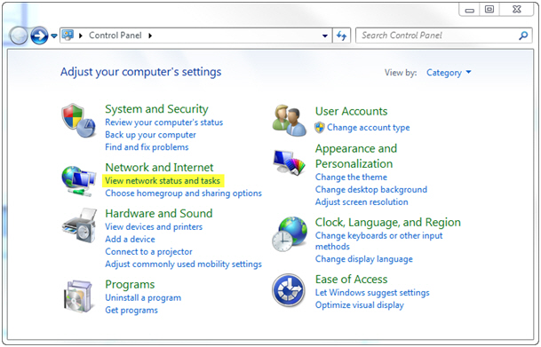 
    </li>
</ol>
Figure 1 - Click on "View network status and tasks"  3. 
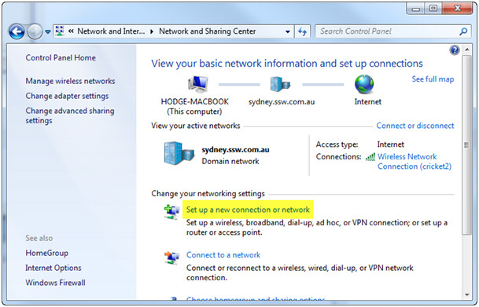Figure 2 - Click on "Setup a new connection or network" 4. 
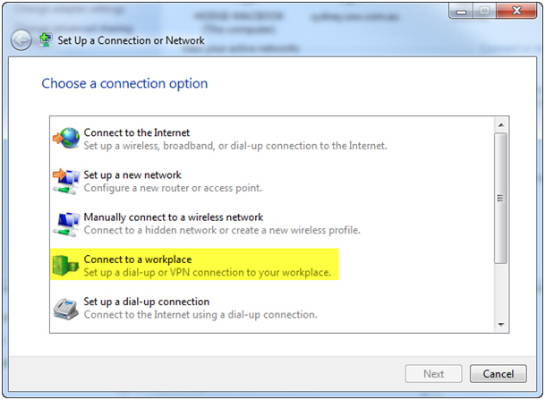 Figure 3 - Select "Connect to a workplace" 5. 
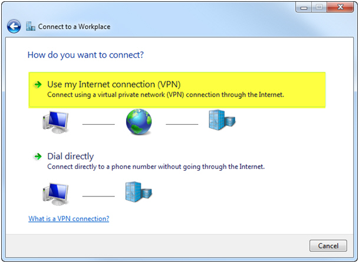Figure 4 - Click "Use my Internet Connection (VPN)"   6. 
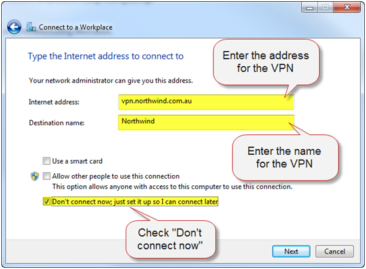Figure 5 - Fill out "Internet Address" and "Destination Name" | Check "Don't Connect Now"  7.  
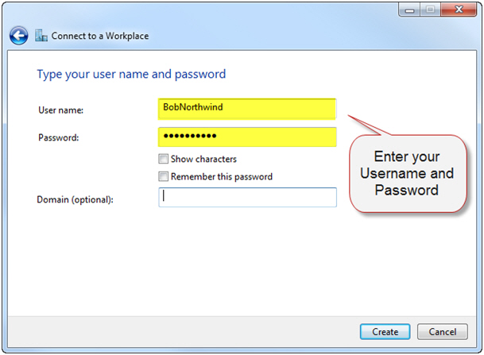Figure 6 - Enter your Username and Password 8. 
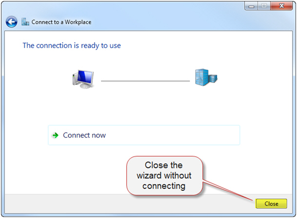Figure 7 - Close the wizard without connecting   9. 
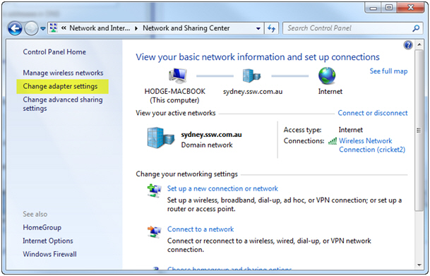Figure 8 - Back in the Control Panel, click “Change adapter settings”   10. 
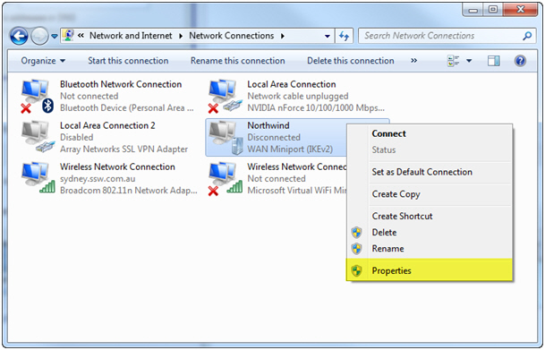 Figure 9 - Right click on your new VPN | Click "Properties"   
 
11. Click on the Networking tab  
12. 
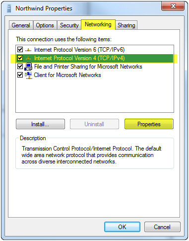Figure 10 - Click on "Internet Protocol Version 4 (TCP/IPv4)" | Click "Properties" 13.Click the Advanced… button 
14.  
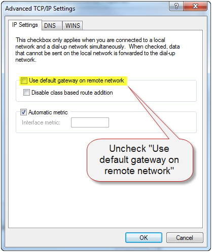Figure 11 - Uncheck "Use default gateway on remote network" 

15. Click OK on all of the open dialogs | Double click on the new VPN  
16.You will notice your username and password is missing – retype these into the VPN connection  
17. Press Connect and your VPN should dial and connect 

