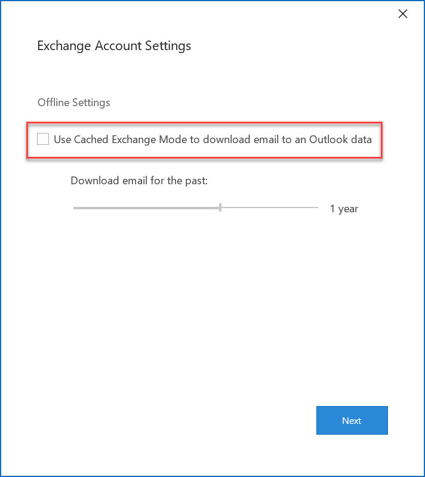
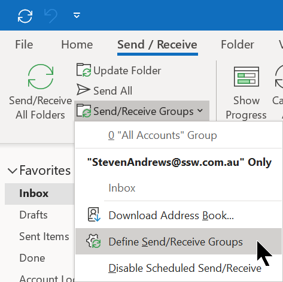

When using your presentation computer you may want to still be able to send emails but not want to download your entire Exchange mailbox to your Boot2VHD image. This is especially relevant for people with large mailboxes.   
<!--endintro-->

Here is how you do it:

1. Open Outlook and create a new Exchange account:        
<dl class="image">&lt;dt&gt; 
             
         &lt;/dt&gt;<dd>Figure - Tick manually configure server settings</dd></dl>
2. Enter your server name and user name, but un-tick         **Use Cached Exchange Mode** :         <dl class="image">&lt;dt&gt; 
             
         &lt;/dt&gt;<dd>Figure - Un-tick Use Cached Exchange Mode</dd></dl>
3. Finish the setup and then open Outlook
4. Configure your Send / Receive Groups:        <dl class="image">&lt;dt&gt; 
             
         &lt;/dt&gt;<dd>Figure - Click Send / Receive | Click Send / Receive Groups | Click Define Send / Receive Groups</dd></dl>
5. Now we can choose the parts of our mailbox we want to synced to our PC. The following options are recommended:
    * Untick               **Receive Mail Items**
    * Tick               **Download offline address book**
    * Tick the               **Outbox** folder
    * Tick the               **Contacts** folder
    * Tick the               **Sent Items** folder,
    * and select               **Download headers only**

<dl class="image">&lt;dt&gt;
            
         &lt;/dt&gt;<dd>Figure - Untick "Receive mail items" | Tick "Sent Items", "Contacts" and "Outbox" | Download only headers for "Sent Items"</dd></dl>
6. When back in the main Outlook window click         **Send / Receive** **All** **Folders** and this will sync your sent items and contacts which will now be available offline

**Suggestion to the Microsoft Outlook Team:**

* Give us a "Sync last x weeks" for each folder
* Give us a "Work in Minimal Mode" that does the above
