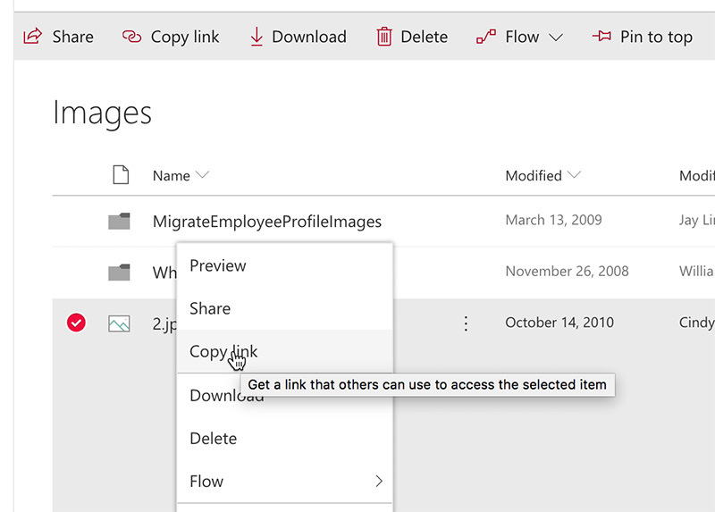

You often need to share links to a file or folder in SharePoint. ​ 
 <excerpt class='endintro'></excerpt> 

You can select the folder (or file) and click on "Copy link" at the top bar to get the link: 
<dl class="image"><dt>
      
   </dt><dd>Figure: Getting URL from SharePoint top bar </dd></dl>
You can also right-click the folder/file to copy the link: 
<dl class="image"><dt>
      
   </dt><dd>Figure: Getting URL by right-clicking a file in SharePoint 
       </dd></dl>
​On previous versions, you can open the menu on ellipsis link and get it from there:
<dl class="image"><dt>
      
   </dt><dd>Figure: Getting URL from SharePoint ellipsis menu​ </dd></dl><h3 class="ssw15-rteElement-H3"> Related Rule​​ </h3><ul><li><a href="/_layouts/15/FIXUPREDIRECT.ASPX?WebId=3dfc0e07-e23a-4cbb-aac2-e778b71166a2&TermSetId=07da3ddf-0924-4cd2-a6d4-a4809ae20160&TermId=fe8da6b9-dcbc-4f01-9dd6-1bce8d8fd962">Do you know not to send attachments​ in emails?​​</a></li></ul>

