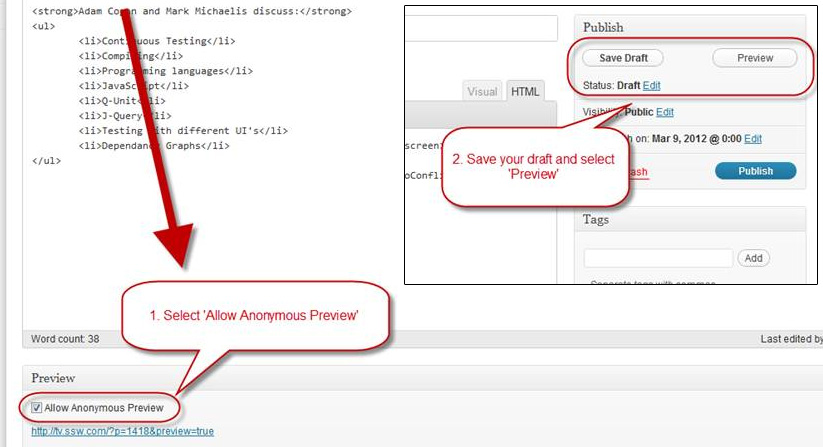
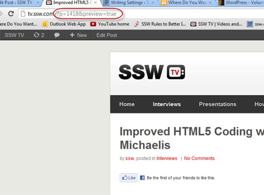
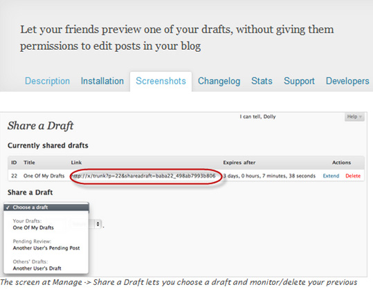

To share a draft of a post with others you need to install a plugin.

The plugin is called 'Simple Preview' and can be located 
   <a href="http://gabriel.nagmay.com/2009/10/simple-preview/" target="_blank">here</a>​. 

 <excerpt class='endintro'></excerpt> 

Once you have plugin installed, all you need to do is enable it and then follow the steps below:

<ol>
<li>In the 'Edit Post' page, scroll down below your HTML panel to the 'Preview' panel, and select the tick box "Allow Anonymous Preview". 
Once enabled, it will create a preview link, that you can send to as many people as you like.  
<strong>Note:</strong> Once you publish the post the URL becomes inactive.</li>
<li>Click on 'Save Draft', then 'Preview'. The post will open in your browser, with the URL that you can share.</li>
</ol>

Figure: How to enable ‘Allow Anonymous Preview’ so you can share your URL before going live

Figure: The URL suffix will be similar to this: ‘…?p=1418&preview=true’

<h4>More Information:</h4>

Note #1: needing a plugin to share a URL privately, is a little bit crazy.

Note #2: Another solution is ‘Share a Draft’, however it has more options and is more complicated.

It has a time limit function for the post, which allows you to set and extend. The URL it generates is a bit messy.

Figure: The URL is pretty messy and it is not as simple as just ticking a box. This is a whole other page

