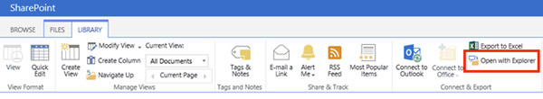
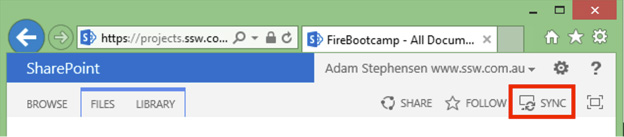
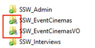
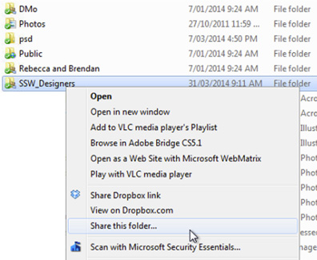
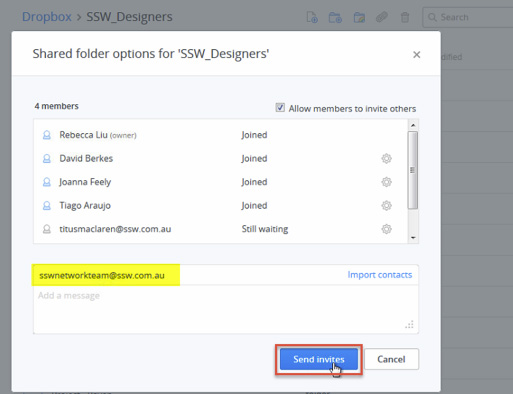
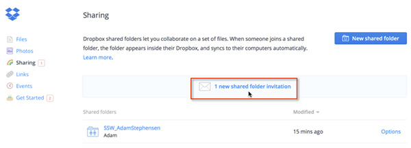

​​ It is important to be able to easily share files between workers. It is also important that all content is backed up centrally in case an employee is unavailable. 

Ideally SharePoint would be used for all content storage but occasionally it is not ideal.

 <excerpt class='endintro'></excerpt> 
<dl class="badImage"><dt>  </dt><dd> Figure: Bad Example - SharePoint Explorer View requires waiting every time you save a file while it syncs back to the server</dd></dl><dl class="badImage"><dt>  </dt><dd> Figure: Bad Example - OneDrive (was SkyDrive) Pro enables offline access and saves locally and then syncs back to the SharePoint server asynchronously, but requires the whole document library to be brought to the local computer, even if you only need one folder in the document library</dd></dl>
<b>Suggestion for OneDrive (was SkyDrive) Team #1 : </b>Enable OneDrive to have selective sync on folders within a document library.
<dl class="badImage"><dt>  </dt><dd> Figure: Bad Example - Files shared via SkyDrive are hard to back up centrally. When you share folders through OneDrive (was SkyDrive) they are only made available through the web interface</dd></dl>
<b>Suggestion to OneDrive (was SkyDrive) Team #2: </b> When folders are shared with another OneDrive user, the shared folder should appear in the recipients OneDrive folder. This allows it to be backed up by a central user at HQ.
<dl class="goodImage"><dt>  </dt><dd> Figure: Good Example -  DropBox allows offline access. When you share a DropBox folder with another Dropbox user, the shared folder appears in the DropBox folder on their machine with a different icon to indicate sharing</dd></dl>
Having the folder on the remote machine allows remote backup. All folders used for SSW Work must be shared with the SSW Dropbox Account. The SSW sys-admin is responsible for backing up the SSW Dropbox account daily.
<dl class="image"><dt>  </dt><dd> Figure: To allow you to use Dropbox for work, first create a folder called SSW_[YourName] (e.g. SSW_AdamStephensen), right click on the folder and choose Share this folder...</dd></dl><dl class="image"><dt>  </dt><dd> Figure: Add the email address of the company Dropbox account and click <strong>Send Invites</strong>. Once the Administrator accepts the share, your important work files will be available in the case that you leave or get hit by a bus</dd></dl><dl class="image"><dt>  </dt><dd> Figure: The Administrator account must now accept the sharing invitation, and the folder will be added to the Administrators Dropbox folder. The Admin should configure a machine to pull the files locally and back them up</dd></dl>

