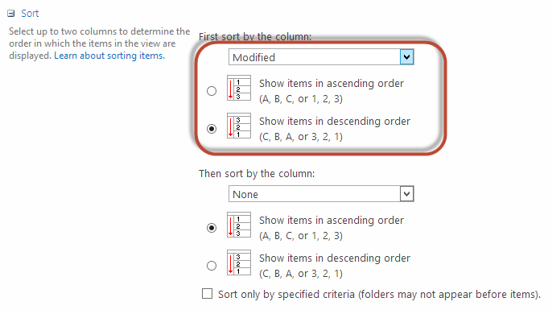

You may know that it is quite easy to sort view by a column through the UI. **Figure: Change view column sort from web UI** 
But when you are trying to do that via code, you may find a pretty tricky issue.

<!--endintro-->
 You can use some code like:


```
view.Query = "<OrderBy><FieldRef Name=\"Modified\" Ascending=\" FALSE \" /></OrderBy>";
```


 **Figure: Use code to change view sort** 
but the below code won't work:


```
view.Query = "<OrderBy><FieldRef Name=\"Modified\" Ascending=\" False \" /></OrderBy>";
```


::: bad
Bad Example - the Ascending attribute is case-sensitive

:::

The full code should be some code like:


```
SPView view = list.DefaultView;
view.Query = "<OrderBy><FieldRef Name=\"Modified\" Ascending=\" FALSE \" /></OrderBy>";
view.Update();
```


::: good
Good Example - the Ascending attribute is using capital charactors as it is case-sensitive  
:::
