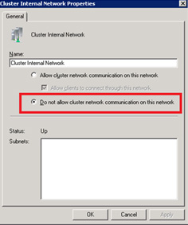

It is important have the Live Migration and Cluster traffic on a separate network interface than the iSCSI or SAN traffic. If you do not you will see a performance hit while migrating virtual machines and the process will be a lot slower.

<!--endintro-->

To specify the roles of each network adapter:

1. Open the Failover Cluster Manager
2. Expand the Networks section and you will see all of your network adapters listed
3. Right click on the network that you are using for LAN and ISCSI and make sure that the following setting is selected

This setting prevents ISCSI and LAN traffic from going over the cluster network
