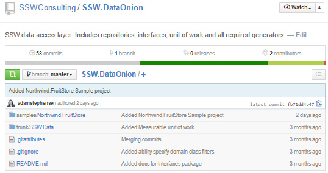
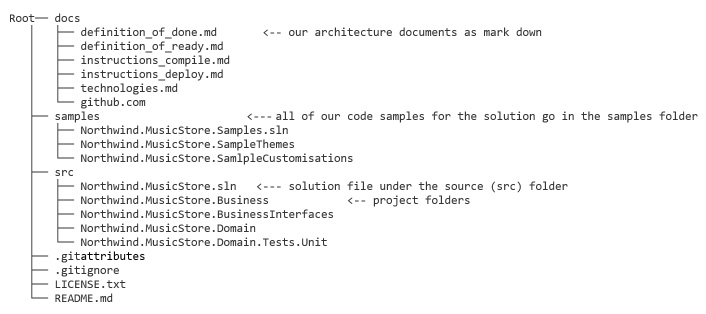

It  is important when working in multiple projects to ensure consistent practices.

Structuring your repositories consistently makes your project feel professional, and makes it easier to work with as it is predictable.

<!--endintro-->
<dl class="badImage">&lt;dt&gt; 
       
   &lt;/dt&gt;<dd>Figure: Bad Example – The folder containing the source code is called ‘trunk’ rather than ‘src’. There is no docs folder containing the important documents as per 
      <a href="/_layouts/15/FIXUPREDIRECT.ASPX?WebId=3dfc0e07-e23a-4cbb-aac2-e778b71166a2&TermSetId=07da3ddf-0924-4cd2-a6d4-a4809ae20160&TermId=951ffbf9-4066-42f3-a9b7-e0d8603e728b">Do you review the documentation?</a></dd></dl><dl class="goodImage">&lt;dt&gt; 
       
   &lt;/dt&gt;<dd>Figure: Good example - All documentation Is in the ‘docs’ folder, samples are in the ‘samples’ folder and all the source code is in the ‘src’ folder </dd></dl>
