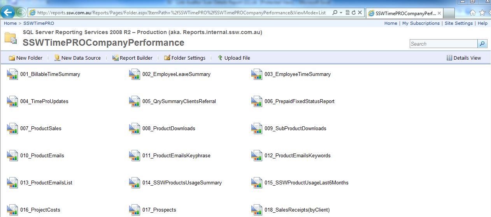
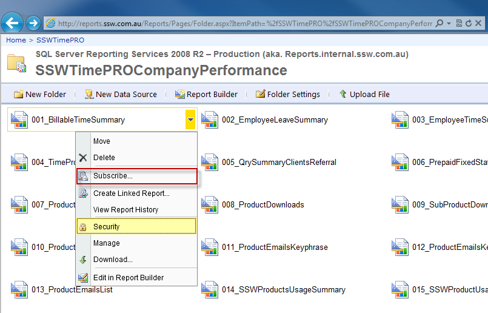

​Here are the steps to subscribe a report:
 

​
 <excerpt class='endintro'></excerpt> 
​1. Open IE, go to the folder view which contains the report you're going to subscribe.

Figure. Reports folder view

 

2. Click the report you're going to subscribe and select "Subscribe...".

 

Figure. Subscribe report

 

3. Configuring​ the subscriber's email address, report render type and schedule.

 

Figure. Configuring subscribe settings

     

