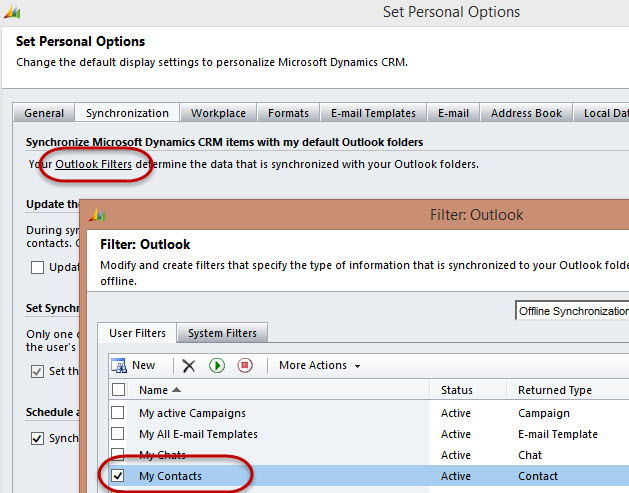

It can be useful to have the contacts you deal with regularly in your Outlook (for           offline access and easy editing).

<!--endintro-->

Contacts that you create or are assigned to you (that have not been deactivated) are your "Active Contacts".     By default, these are the only ones that will sync from CRM to your Outlook. You can, however configure this to use any criteria you want to decide which contacts to sync.

To do this, in Outlook, click File | CRM | Options | Synchronization, and click Outlook Filters.

<dl class="image">&lt;dt&gt; 
      
   &lt;/dt&gt;<dd>Figure: Contact Synchronization enabled in MS Outlook 2013</dd></dl>
In Outlook, you can also choose which of your personal contacts you want to sync to CRM by using the toolbar option "Track" and "Set Parent" (i.e. company).

**You now know how to do this, although it is not recommended**

If your Outlook syncs to your mobile device, and you have a very large number of active contacts (say more than 1,000), it is not a scalable option to sync from CRM as:

* You may get too many contacts to easily deal with.
* Things like voice recognition (e.g. Siri or Cortana) will find more false positives.

Similar issues happen when you sync all your Facebook contacts. You have too many, duplicates, and a new problem to manage.
