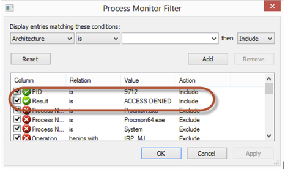
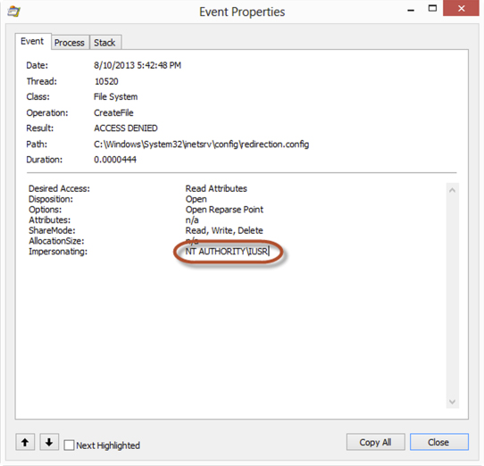

You need     [process monitor](http://technet.microsoft.com/en-us/sysinternals/bb896645.aspx) to track down permissions problems.

E.g.      **Problem**

To hunt down a problem where say the IIS server couldn’t write to a directory, even after you have given permissions to the app pool account.

**Solution**

1. Install and run 
      [process monitor](http://technet.microsoft.com/en-us/sysinternals/bb896645.aspx)
2. Apply filter
3. Rejoice

  

  

<!--endintro-->
