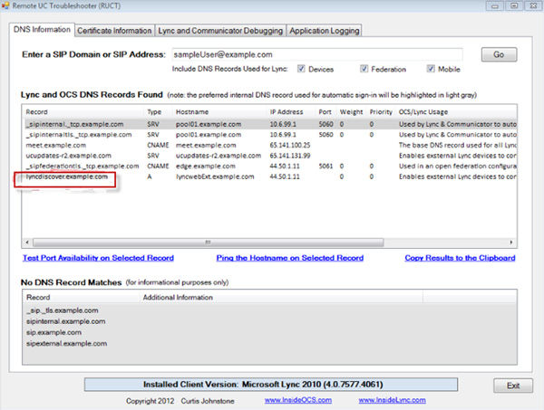
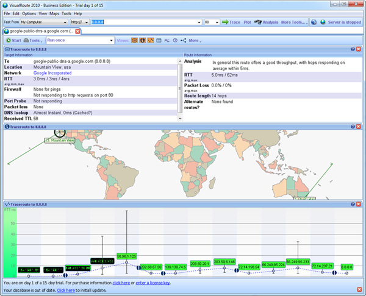

At times especially during the initial implementation, you may encounter some issues with Lync. The following are some of the useful tools which will assist you in identifying where the problem lies.

<!--endintro-->

Remote UC Troubleshooting Tool (RUCT) for Lync will show that the DNS records used by the Lync mobility clients to auto-discover the Lync mobility service have been added. This tool can be acquired from [Inside OCS blog](http://insideocs.com/).

Specifically, you now have the option of querying the locally configured DNS server for the following records:

* Lyncdiscover. (both CNAME or A record)
* Lyncdiscoverinternal. (both CNAME or A record)
* From the same screen, you can ping the resulting hostname or test the port availability on any of the Lync DNS record matches

<dl class="image">&lt;dt&gt;  &lt;/dt&gt;<dd>Figure: Lync Auto-Discovery Mobility DNS record</dd></dl>
### Lync Monitoring Reports

The Monitoring Server collects data from the call detail recording (CDR) and Quality of Experience (QoE) databases and presents that data with the help of the SQL Server Reporting Services and the predefined Monitoring reports. These reports will show statistics which will assist in identifying issues such as network issues such as latency and packet loss.

### Internet Network connectivity tests

Tools such as VisualRoute 2010 will assist in highlight problems related latency and packet loss.
<dl class="image">&lt;dt&gt; &lt;/dt&gt;<dd>Figure: VisualRoute 2010 tool showing a test to a Google DNS server</dd></dl>
Read more about implementing [Microsoft Lync](http://www.ssw.com.au/ssw/Consulting/Lync.aspx).
