
CRM 2016 has many improvements over it's predecessors, including Power BI integration, improved navigation, and the new Outlook extension​.

 
​​The procedure for upgrading CRM 2015 to 2016 is:
 <excerpt class='endintro'></excerpt> 

1. Apply Windows Update on CRM and Database servers

2. Go to CRM server | Deployment Manager | Disable CRM organization
<dl class="ssw15-rteElement-ImageArea">  <strong>Figure: Disable organization</strong><strong><dl class="ssw15-rteElement-ImageArea"><strong> </strong></dl></strong></dl>
3. Back up CRM organization database and configuration database

4. Go to CRM server | Control Panel | Uninstall "Microsoft Dynamics CRM Reporting Extensions"
<dl class="ssw15-rteElement-ImageArea">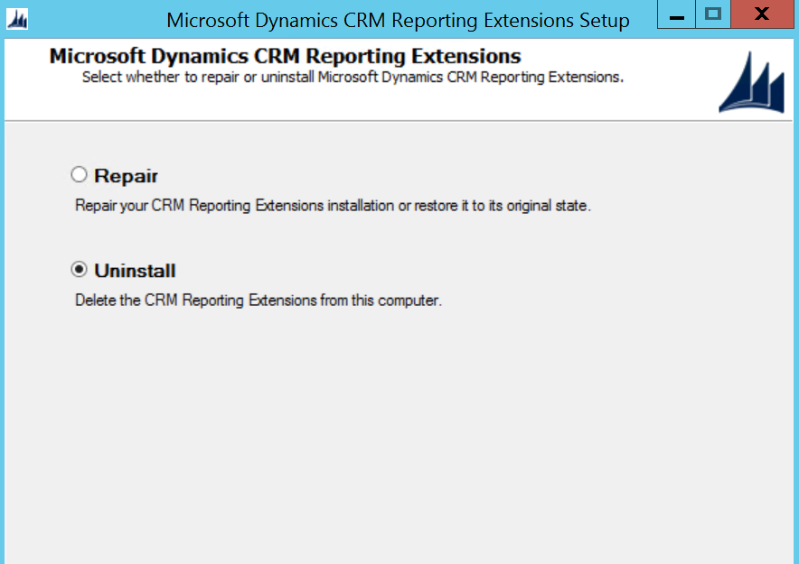 <strong>Figure: Uninstall CRM Reporting Extensions</strong>  </dl>
5. Download <a href="https://www.microsoft.com/en-us/download/details.aspx?id=50372" target="_blank">CRM 2016 Server installation file</a> and start the upgrade
<dl class="ssw15-rteElement-ImageArea">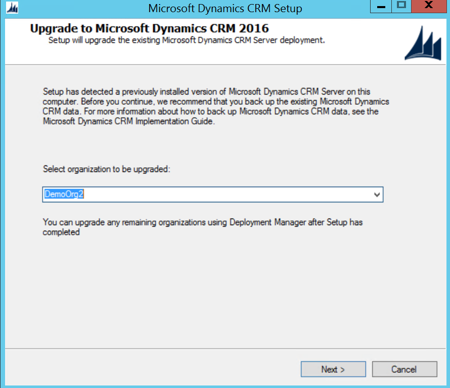 <strong>Figure: Select the demo organization to be upgraded</strong>
​​​​Note: It's better to have an empty demo organization to be upgraded first, so that you can test if the server upgrade has no issues. 
</dl><dl class="ssw15-rteElement-ImageArea">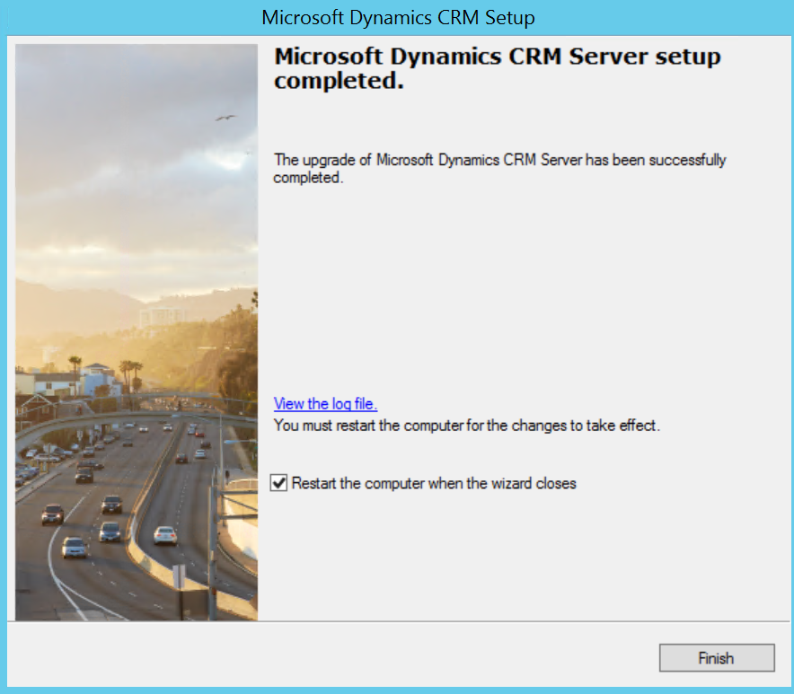 <strong>Figure: Successfully upgraded CRM server</strong><dl class="ssw15-rteElement-ImageArea">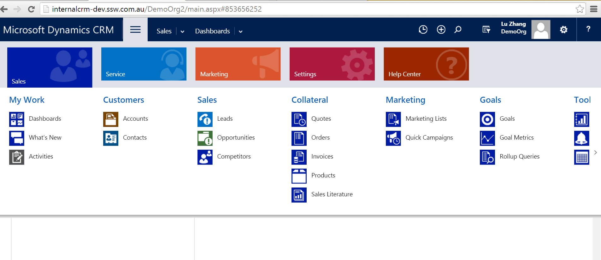<strong> Figure: Quick test on the demo organization </strong><strong><dl class="ssw15-rteElement-ImageArea"><strong>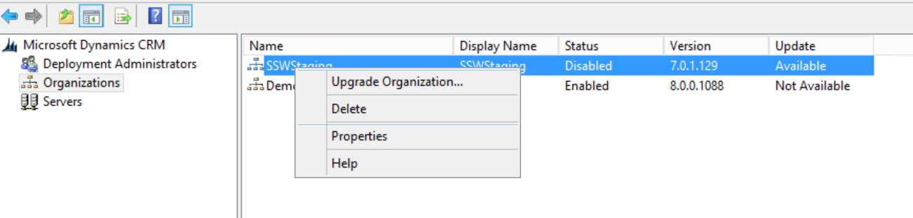Figure: Upgrade business organization </strong><strong><dl class="ssw15-rteElement-ImageArea"><strong>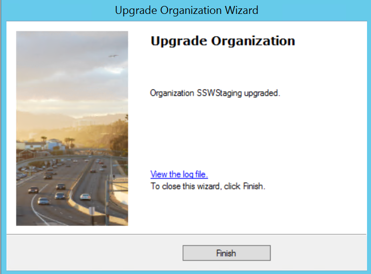Figure: Successfully upgrade organization </strong><strong><dl class="ssw15-rteElement-ImageArea"><strong> </strong></dl></strong></dl></strong></dl></strong></dl></dl>
6. Go to CRM setup directory | SrsDataConnector | Install 'Microsoft Dynamics CRM Reporting Extensions"
<dl class="ssw15-rteElement-ImageArea">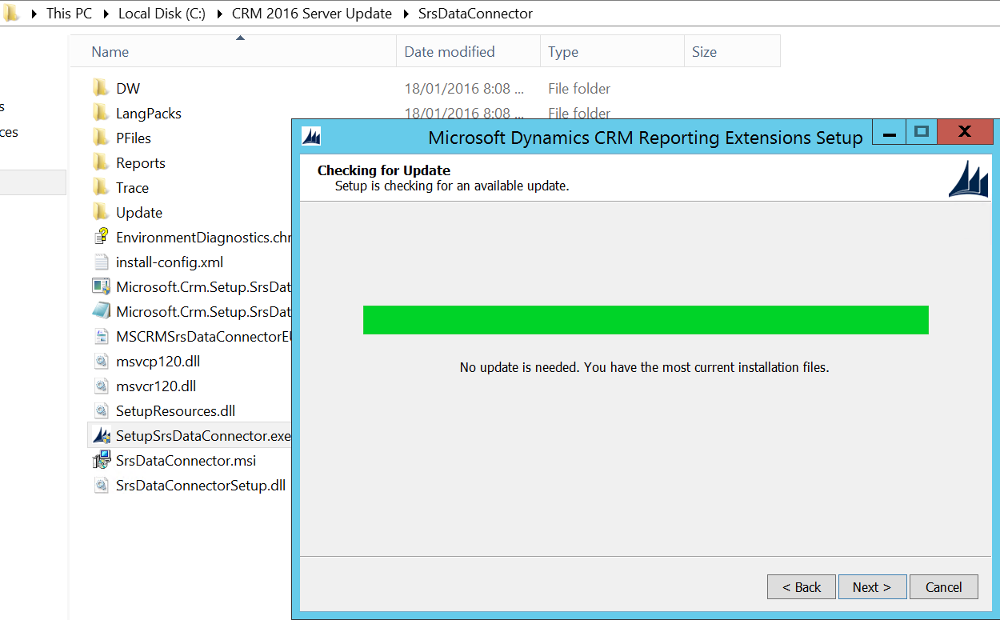 <strong>Figure: Install CRM Reporting Extensions</strong><dl><dl class="ssw15-rteElement-ImageArea">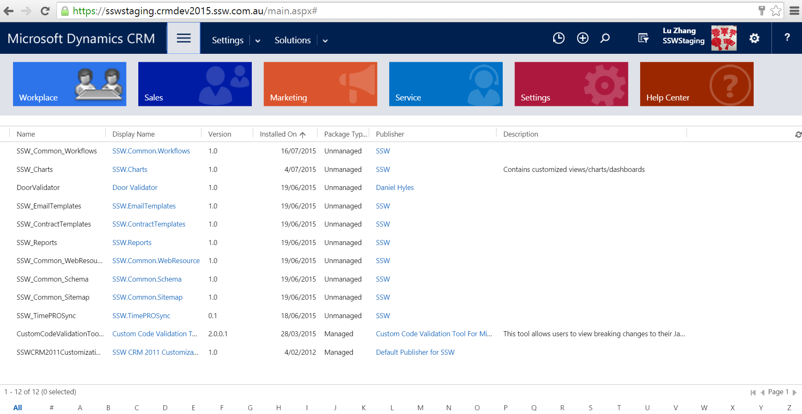<strong>Figure: Successfully upgraded to CRM2016</strong>  
​If using Email Router, do the following 2 steps to upgrade Email Router to 2016 
</dl></dl></dl>
7. Go to CRM server | Uninstall "Microsoft Dynamics CRM 2015 Email Router"
<dl class="ssw15-rteElement-ImageArea">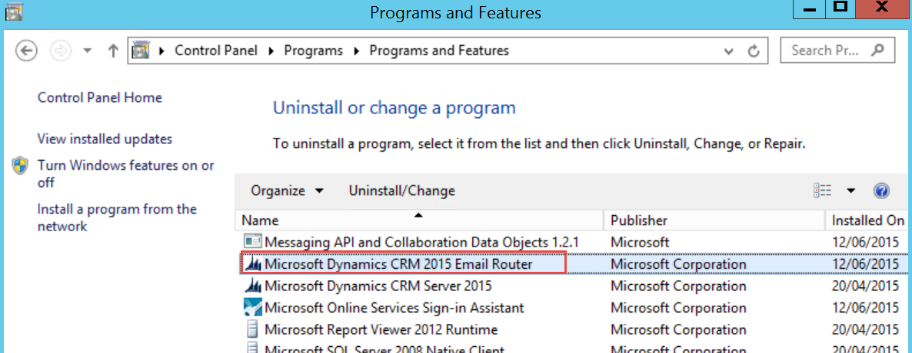 <strong>Figure: Uninstall Email Router 2015</strong><strong><dl class="ssw15-rteElement-ImageArea"><strong> </strong></dl></strong></dl>
8. Download <a href="https://www.microsoft.com/en-us/download/details.aspx?id=50373" target="_blank">CRM 2016 Email Router</a> and install
<dl class="ssw15-rteElement-ImageArea">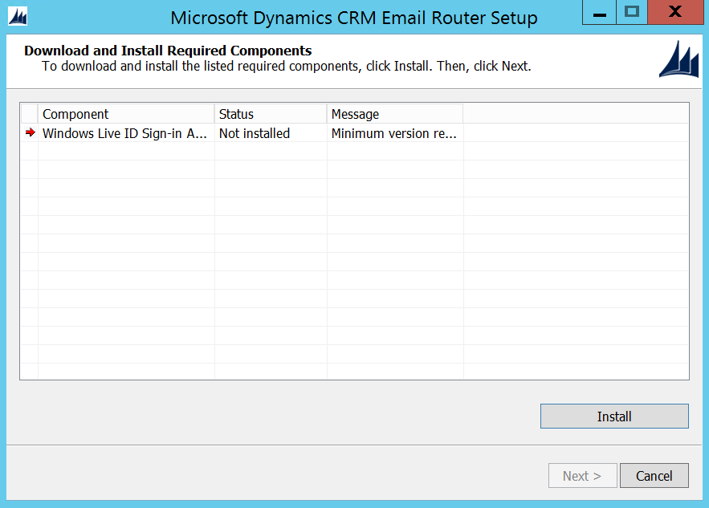<strong> Figure: Install required components for Email Router 2016</strong></dl><dl class="ssw15-rteElement-ImageArea"><strong> Figure: Successfully installed Email Router 2016</strong><strong><dl class="ssw15-rteElement-ImageArea"><strong>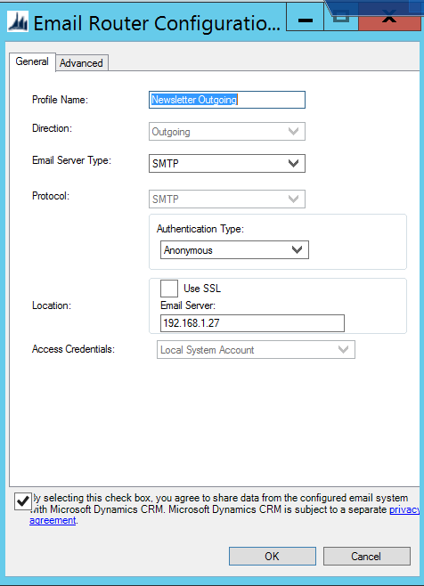 Figure: Configure​ Email Router </strong></dl></strong></dl>
You're now ready to roll with Microsoft Dynamics CRM 2016. If you had any trouble with this guide, please let us know with a rating of this rule.

