Since [we recommend doing a "move based upgrade"](/Pages/MigrationChoices.aspx), we don’t like the "in place upgrade" option, these are the steps:

1. Copy the TFS2008 backups to TFS2010 server (e.g. C:\TfsBackups)
2. Restore all the databases to TFS2010’s instance of SQL 2008
3. Install Team Foundation Server 2010
4. After the install has completed the Team Foundation Server Configuration Wizard will open
5. Select Upgrade | Start Wizard

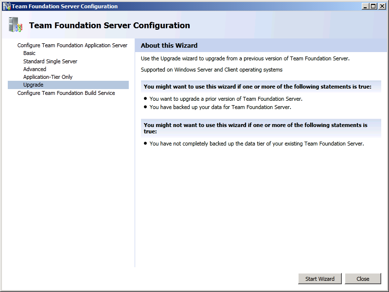
6. Click "Next"

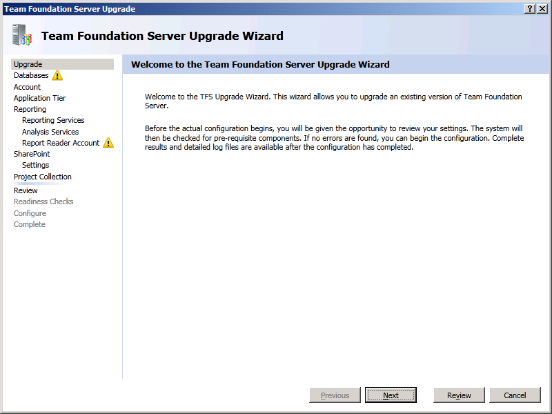
7. Click "List Available Databases"
8. Select the TfsIntegration database
9. Check "By checking this box, I confirm that I have a current backup"
10. Click "Next"

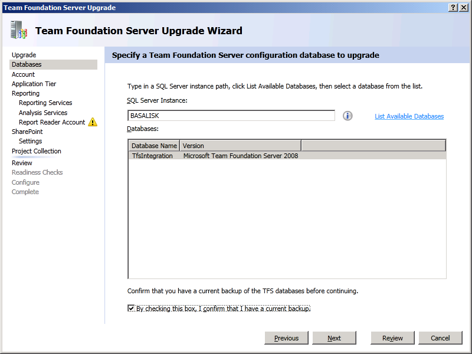
11. Select "NT AUTHORITY\NETWORK SERVICE" for the System account
12. Click "Next" 

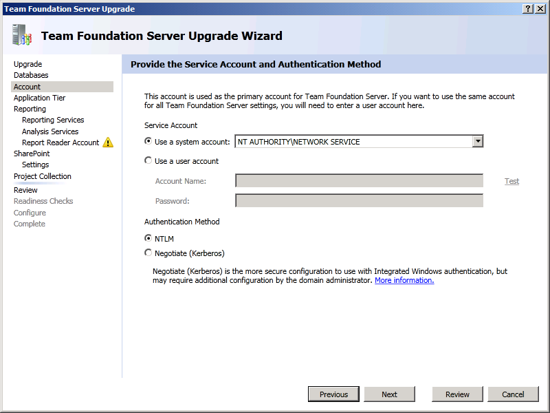
13. Click "Next"

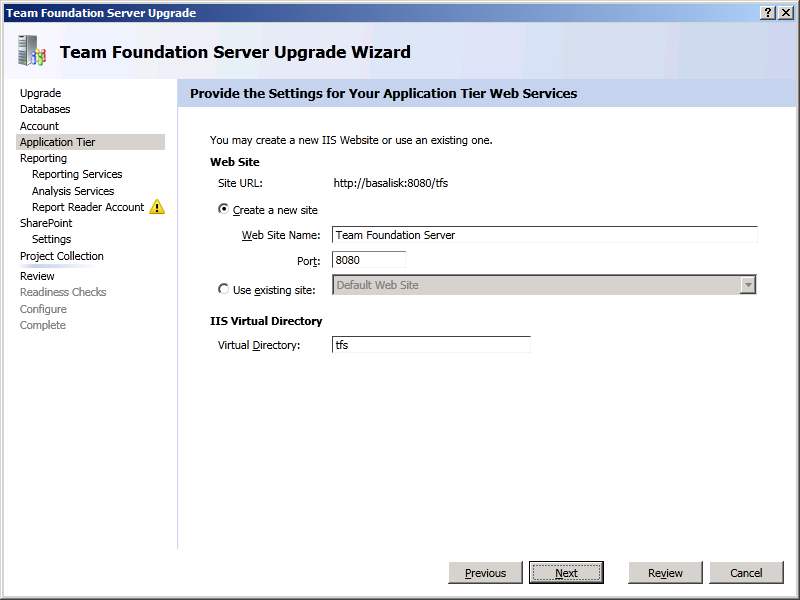
14. Click "Next"

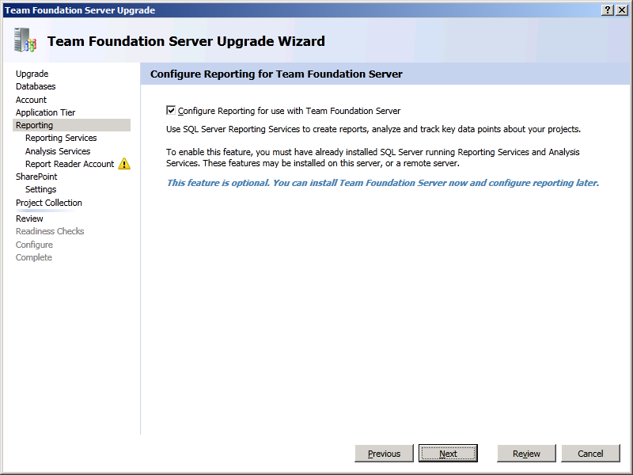
15. Click "Next"

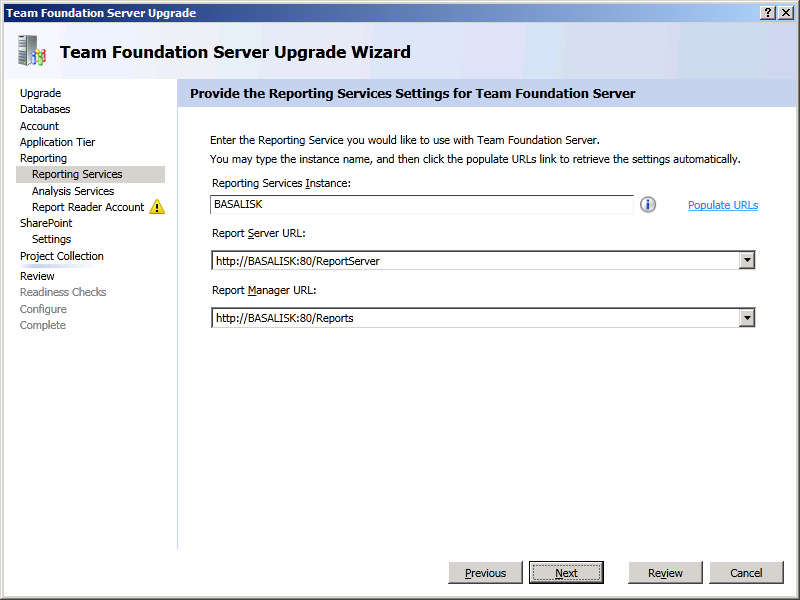
16. Click "Next"

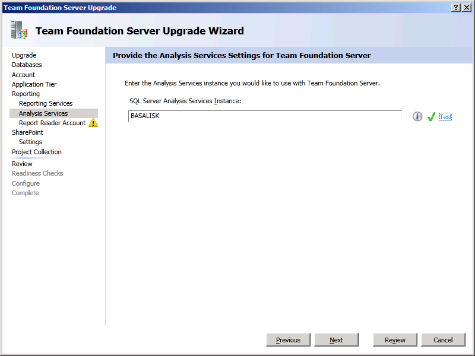
17. Specify the TFSService account
18. Click "Next"

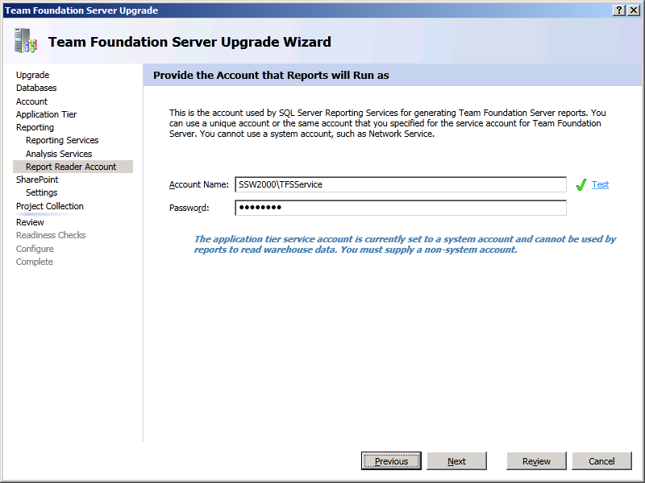
19. Click "Next"

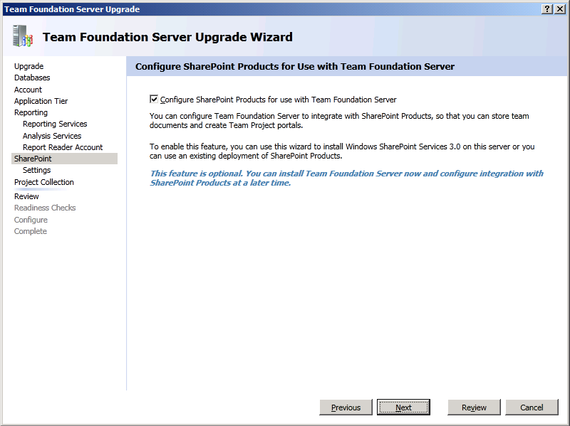
20. Click "Next"

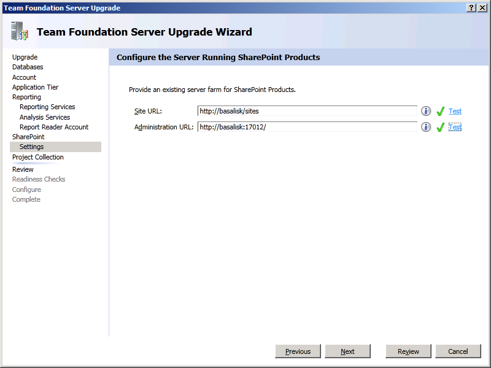
21. Click "Next"

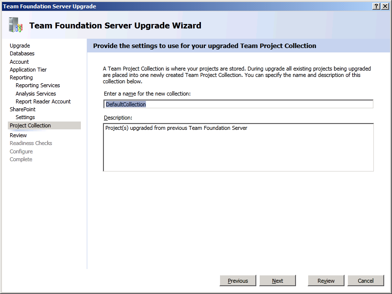
22. Click "Next"

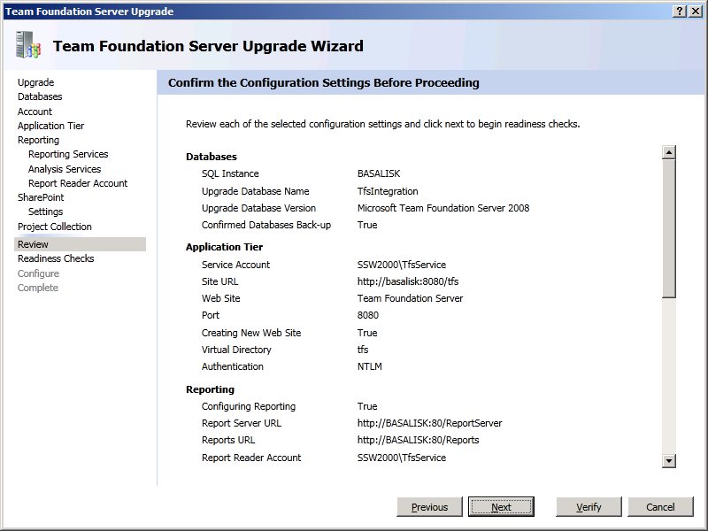
23. Click "Configure"

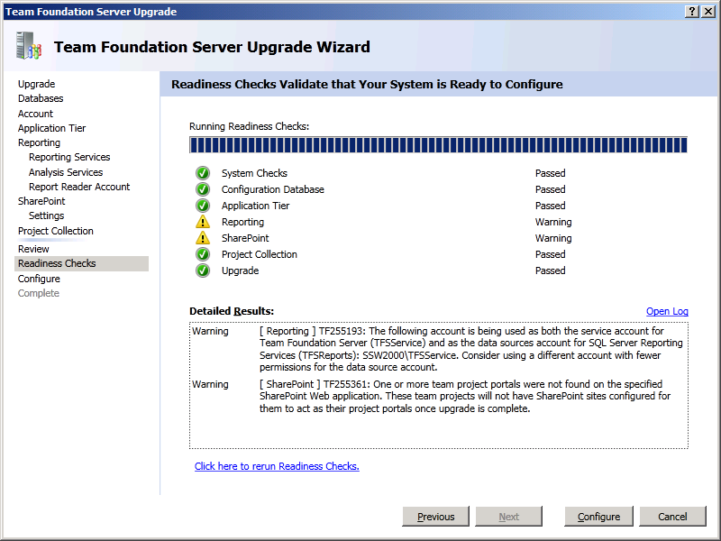
24. Have coffee (2 hours)

BTW: A good user interface should have a coffee image 
[TODO: Martin to create new rule in "Rules to better UI"]
[TODO: Martin to add suggestion to TFS]

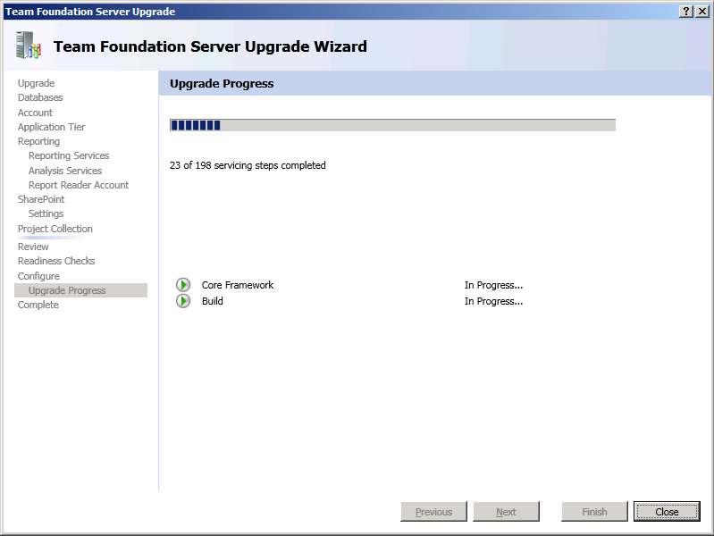
25. Click "Next"

26. Click "Close"

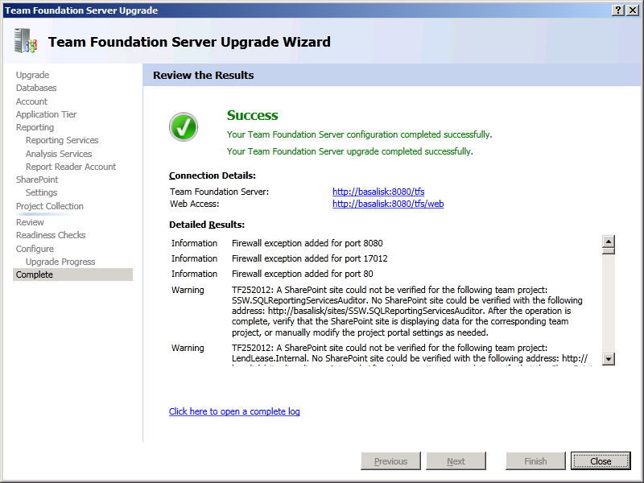
27. Click "Close"

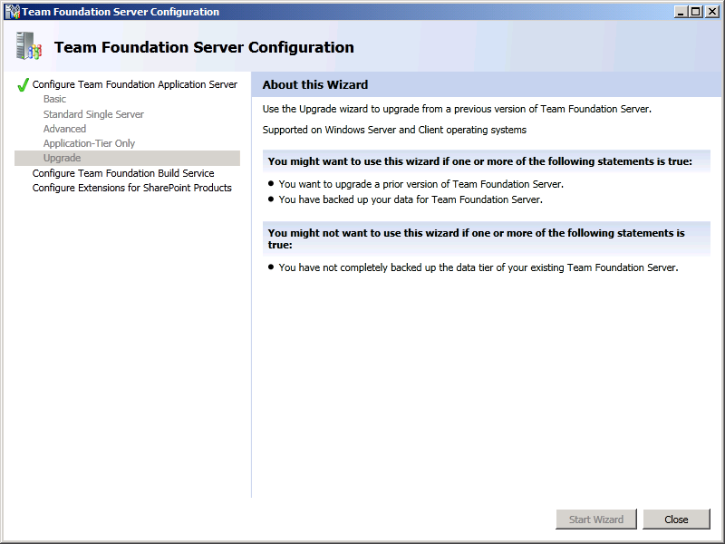
28. Change the DNS entry for tfs.northwind.com to point to TFS2010 on
    1. Internal DNS
    2. External DNS

|  | Since you have to deal with your system admins, this job will take the longest. Speed it up by buying a Red Bull for your system admin |
| --- | --- |

<!--endintro-->
