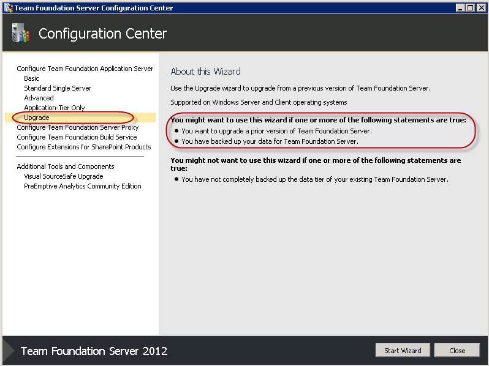
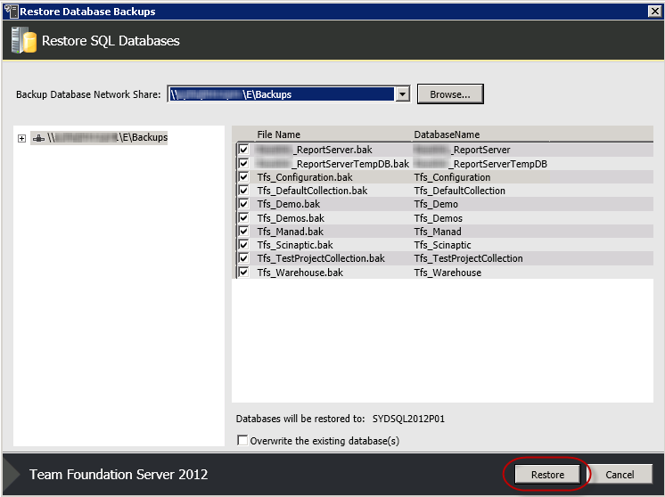
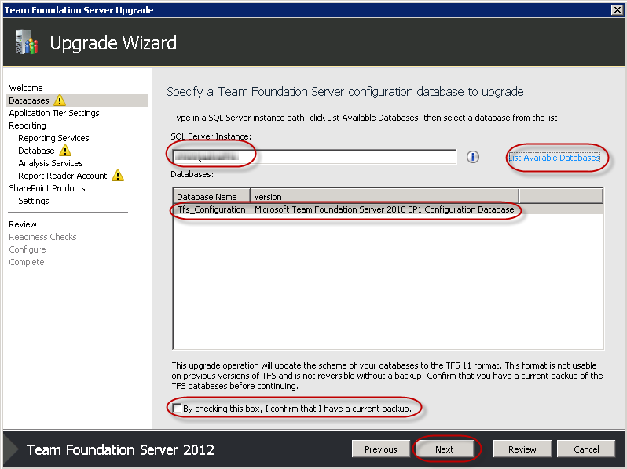
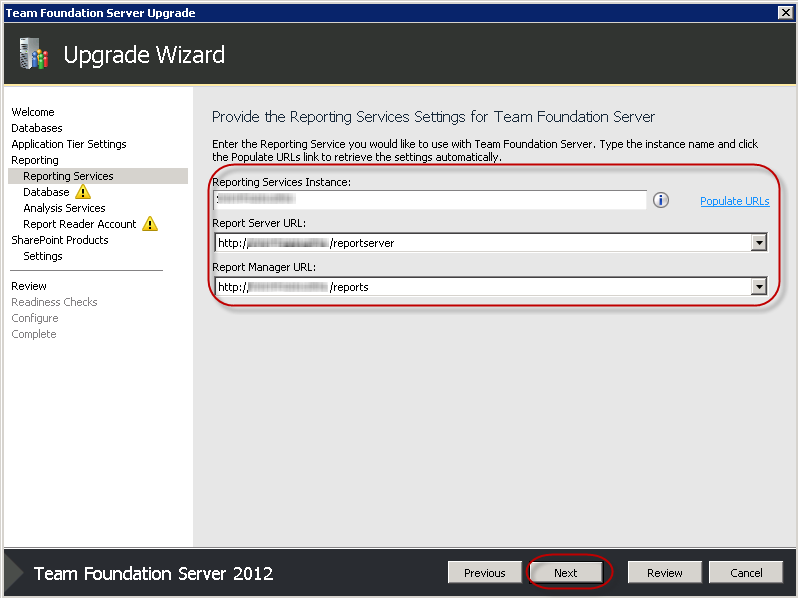
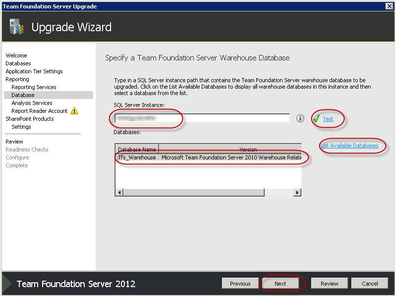
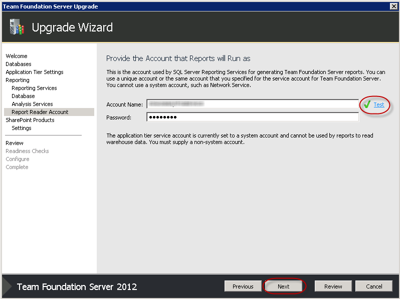
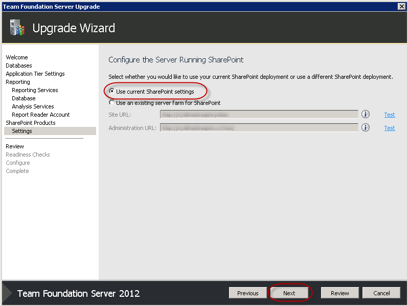
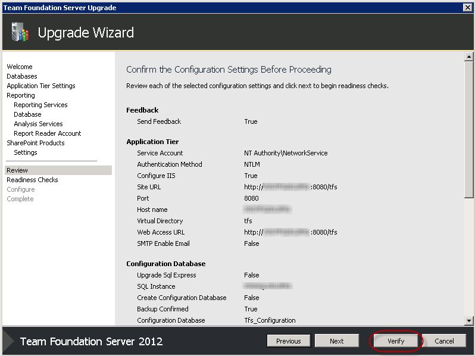
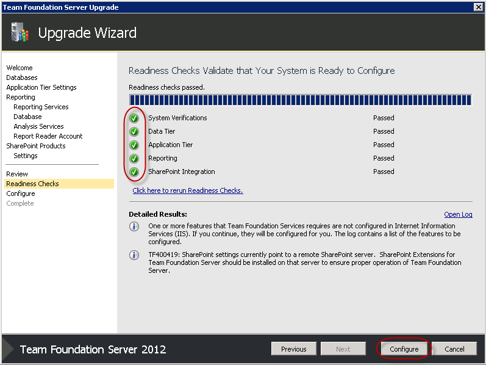
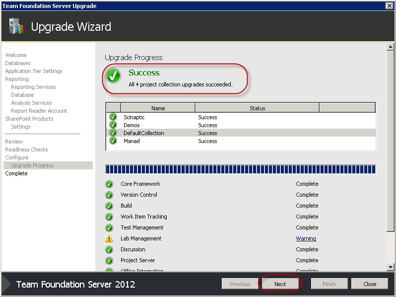

We recommend doing a [move to a new environment](/Pages/MigrationChoices.aspx) because it has a much easier rollback path if something goes wrong.

Note that these steps will also work for upgrading from TFS 2012 RC to RTM, or RTM to Update 1.

<!--endintro-->

These are the steps to migrate and upgrade to a new environment:

1. [Send an email](http://www.ssw.com.au/SSW/Standards/Rules/RulesToBetterNetworks.aspx#rebootrestart) to let everyone know the TFS server will be offline.
2. Take the TFS 2010 server offline
3. Copy the TFS 2010 database backups to the TFS server or the new SQL Server instance. Make sure the URL is accessible from the TFS server via a network share.
4. Install Team Foundation Server 2012 or TFS 2012 Update 1 ([see Damian Brady's experiences](http://blog.damianbrady.com.au/2012/11/27/tfs-2012-with-update-1-done/)).
5. Make sure you have access to coffee while it's installing - it could take a while!

6. After the install has completed, the Team Foundation Server Configuration Center will start
7. Select Upgrade | Start Wizard

8. Launch the Database Restore tool by clicking on the link
9. If necessary, change the Target SQL Server Instance and click Connect
10. In the Restore Database screen, Browse, then navigate to the folder with your database backups. Make sure all of them are ticked, then click Restore.

11. Click Close, then click Next in the Upgrade Wizard
12. Choose the configuration database by specifying the SQL Server Instance and clicking List Available Databases
13. Check "By checking this box, I confirm that I have a current backup.", then click Next

14. Leave Network Service as the service account for the Application Tier, then click Next
15. Check the checkbox to confirm we want to configure Reporting Services, then click Next
16. Make sure the Reporting Services instance and URLs are correct, then click Next

17. Update the SQL Server Instance for our Warehouse Database, and click Test to test the connection
18. Click List Available Databases and check the Tfs\_Warehouse database is shown, then click Next

19. Click Next on the Analysis Services page
20. Provide details of the TFSService account your reports will run as then click Next

21. Check the checkbox to say we want to configure SharePoint, then click Next
22. Choose "Use current SharePoint settings", then click Next

23. Confirm the details on the Summary page and click Verify

 **Note:** At this point, you may be asked to reboot and start the wizard again.  Don't despair - it's quicker the second time!
24. Once you have all green ticks, click Configure

25. Have a coffee

26. Click Next

27. Click Close, then Close again.
28. Change the DNS entries for your TFS server to point to the new TFS 2012 server

 **Note:** It's a good idea to get the SysAdmins involved at this stage
