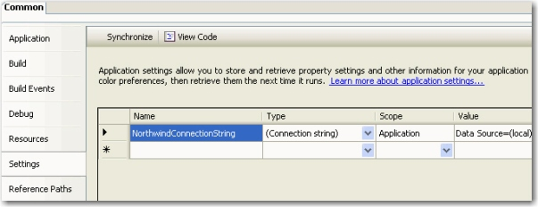

In .NET 1.1 we used to store our connection string in a configuration file like this: 

 <excerpt class='endintro'></excerpt> 

  
 

<dl class="goodCode">
    <dt style="width:92.01%;height:134px;">
    <pre>&lt;configuration&gt;      &lt;appSettings&gt;           &lt;add key="ConnectionString" value ="integrated security=true;            data source=(local);initial catalog=Northwind"/&gt;      &lt;/appSettings&gt; &lt;/configuration&gt;</pre>
    </dt>
</dl>

and access this connection string in code like this:

<dl class="badCode">
    <dt style="width:92.01%;height:74px;">
    <pre>SqlConnection sqlConn =  new SqlConnection(System.Configuration.ConfigurationSettings. AppSettings["ConnectionString"]);                        </pre>
    </dt>
    <dd>Bad example - old ASP.NET 1.1 way, untyped and prone to error. </dd>
</dl>

In .NET 2.0 you can access it in another way

Step 1: Setup your settings in your common project. E.g. Northwind.Common 

<dl class="image">
    <dt> </dt>
    <dd>Figure: Settings in Project Properties</dd>
</dl>

Step 2: Open up the generated App.config under your common project. E.g. Northwind.Common/App.config 

<dl class="image">
    <dt> </dt>
    <dd>Figure: Auto generated app.config</dd>
</dl>

Step 3: <s>Copy the content into your entry applications app.config. E.g. Northwind.WindowsUI/App.config</s> The new setting has been updated to app.config automatically in .NET 2.0 

<dl class="badCode">
    <dt style="width:92.31%;height:184px;">
    <pre> &lt;configuration&gt;       &lt;connectionStrings&gt;          &lt;add name="Common.Properties.Settings.NorthwindConnectionString"               connectionString="Data Source=(local);Initial Catalog=Northwind;               Integrated Security=True"               providerName="System.Data.SqlClient" /&gt;         &lt;/connectionStrings&gt;  &lt;/configuration&gt;                        </pre>
    </dt>
</dl>

Then you can access the connection string like this in C#

<dl class="goodCode">
    <dt style="width:93.36%;height:59px;">
    <pre>SqlConnection sqlConn =  new SqlConnection(Common.Properties.Settings.Default.NorthwindConnectionString);                                </pre>
    </dt>
    <dd>Good example - access our connection string by strongly typed generated settings class. </dd>
</dl>

Please note these steps does not work for web site model in Visual Studio 2005. However, they work for other projects such as Windows Form, Console application, Class Library and Web Application Project. 

This is not an issue in a well designed website, since it's connection string will be defined in the <b>data layer</b> and you can overwrite this connection string in your web.config. 

