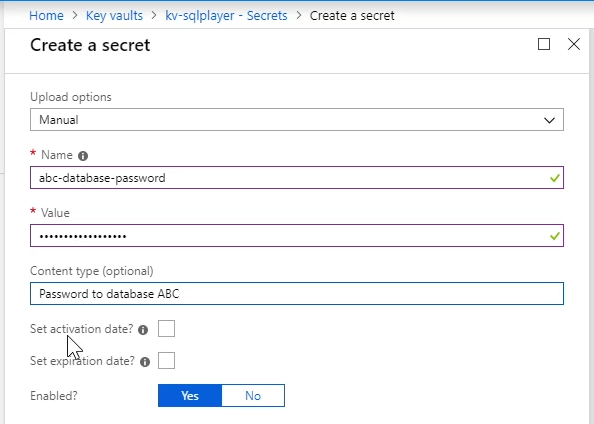
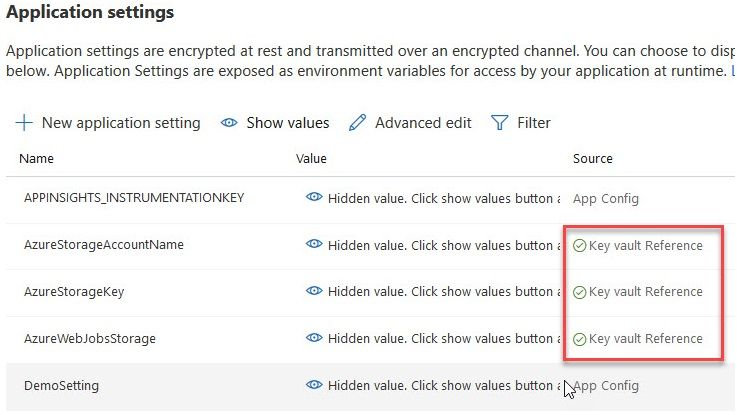

In .NET 1.1 we used to store our connection string in a configuration file like this:   
<!--endintro-->


```xml
<configuration>
     <appSettings>
          <add key="ConnectionString" value ="integrated security=true;
           data source=(local);initial catalog=Northwind"/>
     </appSettings>
</configuration>
```


and access this connection string in code like this:


```cs
SqlConnection sqlConn = 
new SqlConnection(System.Configuration.ConfigurationSettings.
AppSettings["ConnectionString"]);
```

::: bad
Bad example - old ASP.NET 1.1 way, untyped and prone to error.  
:::
          
In .NET 2.0 we used strongly typed settings classes:

Step 1: Setup your settings in your common project. E.g. Northwind.Common

  

Step 2: Open up the generated App.config under your common project. E.g. Northwind.Common/App.config

  

Step 3: ~~Copy the content into your entry applications app.config. E.g. Northwind.WindowsUI/App.config~~ The new setting has been updated to app.config automatically in .NET 2.0


```xml
<configuration>
      <connectionStrings>
         <add name="Common.Properties.Settings.NorthwindConnectionString"
              connectionString="Data Source=(local);Initial Catalog=Northwind;
              Integrated Security=True"
              providerName="System.Data.SqlClient" />
        </connectionStrings>
 </configuration>
```


Then you can access the connection string like this in C#


```cs
SqlConnection sqlConn =
 new SqlConnection(Common.Properties.Settings.Default.NorthwindConnectionString);
```

::: bad
Bad example - access our connection string by strongly typed generated settings class...this is no longer the best way to do it 
:::

In .NET 5, we use Azure Key Vault to securely store our connection strings away from prying eyes:

::: good

:::


::: good

:::
