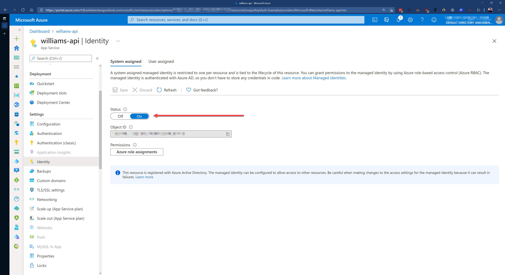
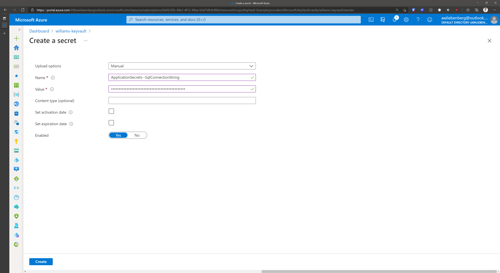
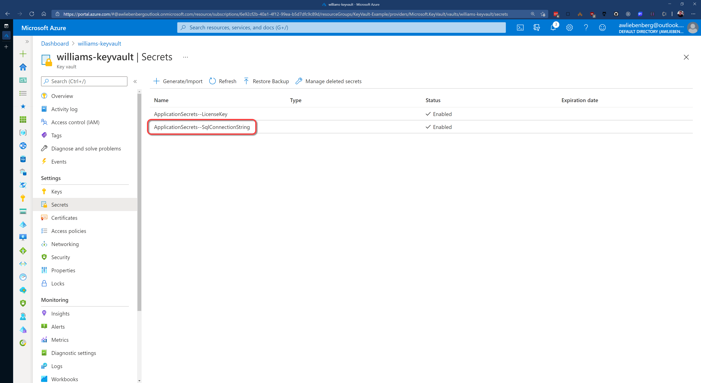

There are 2 type of connection strings. The first contains only address type information without authorization secrets. These can use all of the simpler methods of storing configuration as none of this data is secret.

### Option 1 - Using Azure Managed Identities (Recommended)

When deploying an Azure hosted application we can use Azure Managed Identities to avoid having to include a password or key inside our connection string. This means we really just need to keep the address or url to the service in our application configuration. Because our application has a Managed Identity, this can be treated in the same way as a user's Azure AD identity and specific roles can be assigned to grant the application access to required services.

This is the preferred method wherever possible, because it eliminates the need for any secrets to be stored. The other advantage is that for many services the level of access control available using Managed Identities is much more granular making it much easier to follow the **Principle of Least Privilege**.

### Option 2 - Connection Strings with passwords or keys

If you have to use some sort of secret or key to login to the service being referenced, then some thought needs to be given to how those secrets can be secured.
Take a look at [Do you store your secrets securely](/store-your-secrets-securely) to learn how to keep your secrets secure.

#### Example - Integrating Azure Key Vault into your ASP.NET Core application

In .NET 5 we can use **Azure Key Vault** to securely store our connection strings away from prying eyes.

Azure Key Vault is great for keeping your secrets secret because you can control access to the vault via Access Policies. The access policies allows you to add Users and Applications with customized permissions. Make sure you enable the System assigned identity for your App Service, this is required for adding it to Key Vault via Access Policies.

You can integrate Key Vault directly into your [ASP.NET Core application configuration](https://docs.microsoft.com/en-us/aspnet/core/security/key-vault-configuration?view=aspnetcore-5.0). This allows you to access Key Vault secrets via `IConfiguration`.

``` cs
public static IHostBuilder CreateHostBuilder(string[] args) =>
 Host.CreateDefaultBuilder(args)
  .ConfigureWebHostDefaults(webBuilder =>
  {
   webBuilder
    .UseStartup<Startup>()
    .ConfigureAppConfiguration((context, config) =>
    {
     // To run the "Production" app locally, modify your launchSettings.json file
     // -> set ASPNETCORE_ENVIRONMENT value as "Production"
     if (context.HostingEnvironment.IsProduction())
     {
      IConfigurationRoot builtConfig = config.Build();

      // ATTENTION:
      //
      // If running the app from your local dev machine (not in Azure AppService),
      // -> use the AzureCliCredential provider.
      // -> This means you have to log in locally via `az login` before running the app on your local machine.
      //
      // If running the app from Azure AppService
      // -> use the DefaultAzureCredential provider
      //
      TokenCredential cred = context.HostingEnvironment.IsAzureAppService() ?
       new DefaultAzureCredential(false) : new AzureCliCredential();

      var keyvaultUri = new Uri($"https://{builtConfig["KeyVaultName"]}.vault.azure.net/");
      var secretClient = new SecretClient(keyvaultUri, cred);
      config.AddAzureKeyVault(secretClient, new KeyVaultSecretManager());
     }
    });
  });
```

::: good
Good example - For a complete example, refer to this [sample application](https://github.com/william-liebenberg/keyvault-example)
:::

::: info
**Tip:** You can detect if your application is running on your local machine or on an Azure AppService by looking for the `WEBSITE_SITE_NAME` environment variable. If null or empty, then you are NOT running on an Azure AppService.
:::

``` cs
public static class IWebHostEnvironmentExtensions
{
 public static bool IsAzureAppService(this IWebHostEnvironment env)
 {
  var websiteName = Environment.GetEnvironmentVariable("WEBSITE_SITE_NAME");
  return string.IsNullOrEmpty(websiteName) is not true;
 }
}
```

### Setting up your Key Vault correctly

In order to access the secrets in Key Vault, you (as User) or an Application must have been granted permission via a Key Vault Access Policy.

Applications require at least the LIST and GET permissions, otherwise the Key Vault integration will fail to retrieve secrets.


Azure Key Vault and App Services can easily trust each other by making use of System assigned Managed Identities. Azure takes care of all the complicated logic behind the scenes for these two services to communicate with each other - reducing the complexity for application developers.

So, make sure that your Azure App Service has the **System assigned identity** enabled.

Once enabled, you can create a Key Vault Access policy to give your App Service permission to retrieve secrets from the Key Vault.



Adding secrets into Key Vault is easy.

1. Create a new secret by clicking on the **Generate/Import** button
2. Provide the **name**
3. Provide the secret **value**
4. Click **Create**





**Note:** The ApplicationSecrets section is indicated by "ApplicationSecrets--" instead of "ApplicationSecrets:".

As a result of storing secrets in Key Vault, your Azure App Service configuration (app settings) will be nice and clean. You should not see any fields that contain passwords or keys. Only basic configuration values.


`youtube: https://www.youtube.com/embed/ZG7IykWdlng`

**Video: Watch SSW's William Liebenberg explain Connection Strings and Key Vault in more detail (8 min)**

### History of Connection Strings

In .NET 1.1 we used to store our connection string in a configuration file like this:

``` xml
<configuration>
     <appSettings>
          <add key="ConnectionString" value ="integrated security=true;
           data source=(local);initial catalog=Northwind"/>
     </appSettings>
</configuration>
```

...and access this connection string in code like this:

``` cs
SqlConnection sqlConn = 
new SqlConnection(System.Configuration.ConfigurationSettings.
AppSettings["ConnectionString"]);
```

::: bad
Historical example - Old ASP.NET 1.1 way, untyped and prone to error
:::

In .NET 2.0 we used strongly typed settings classes:

**Step 1:** Setup your settings in your common project. E.g. Northwind.Common


**Step 2:** Open up the generated App.config under your common project. E.g. Northwind.Common/App.config

**Step 3:** ~~Copy the content into your entry applications app.config. E.g. Northwind.WindowsUI/App.config~~ The new setting has been updated to app.config automatically in .NET 2.0

``` xml
<configuration>
      <connectionStrings>
         <add name="Common.Properties.Settings.NorthwindConnectionString"
              connectionString="Data Source=(local);Initial Catalog=Northwind;
              Integrated Security=True"
              providerName="System.Data.SqlClient" />
        </connectionStrings>
 </configuration>
```

...then you can access the connection string like this in C#:

``` cs
SqlConnection sqlConn =
 new SqlConnection(Common.Properties.Settings.Default.NorthwindConnectionString);
```

::: bad
Historical example - Access our connection string by strongly typed generated settings class...this is no longer the best way to do it
:::
