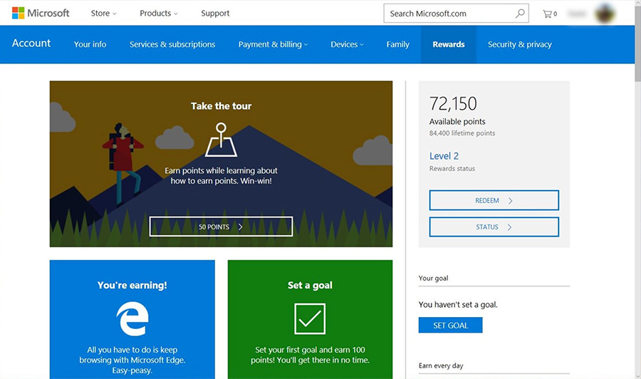
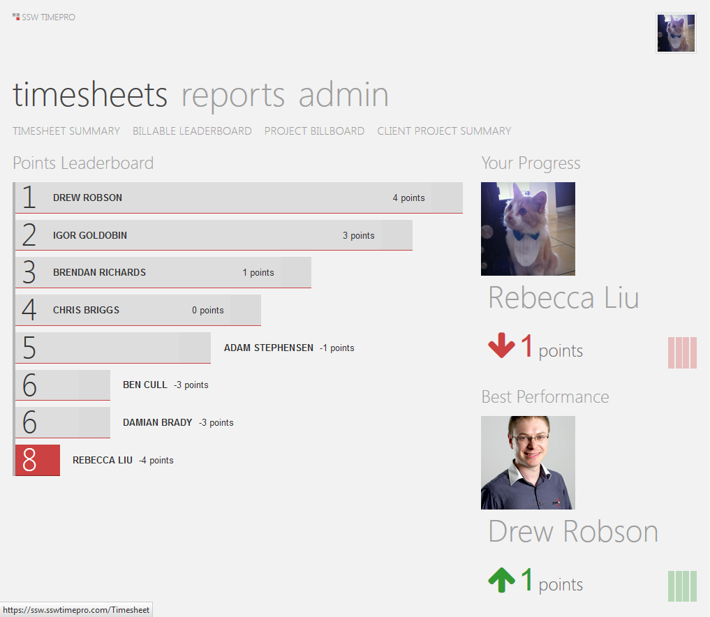

​"Gamification" is a method of encouraging user participation. Usually, these are a set of incentives such as points or achievement badges which are linked to some other form of redeemable value.​​ 

 <excerpt class='endintro'></excerpt> 

​​It originated with Frequent Flyer programs and has crossed over into the software world with the success of Foursquare​.

This concept is being utilized even in 
   <a href="https://channel9.msdn.com/achievements/visualstudio" target="_blank">Visual Studio</a>. 
<dl class="goodImage"><dt> 
      
   </dt><dd>Figure: Good Example – Microsoft Rewards gives points when you search on Bing.com and buy things from the Microsoft Store online and in Windows 10 ​</dd></dl><dl class="goodImage"><dt> 
       
   </dt><dd>Figure: Good Example – Stack Overflow uses reputation points, awarded by how useful your answer to other user submitted questions were</dd></dl><dl class="goodImage"><dt> 
       
   </dt><dd>Figure: Good Example – TimePro uses gamification to encourage users to do their timesheets on time </dd></dl><dl class="goodImage"><dt> </dt><dd>Figure: Good Example – SugarLearning Leaderboard is another good example </dd></dl><dl class="goodImage"><dt> 
       
   </dt><dd>Figure: Good Example – Dropbox rewards its users with extra storage space instead of imaginary points. This is more interesting </dd></dl>

