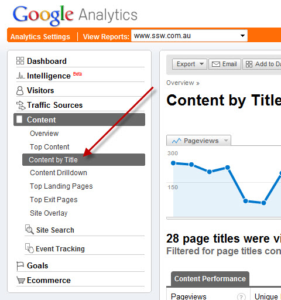
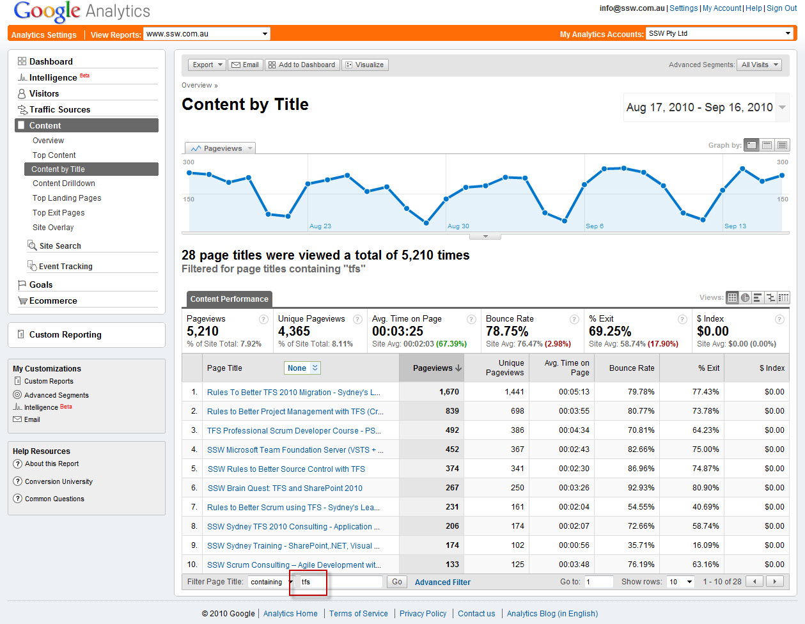
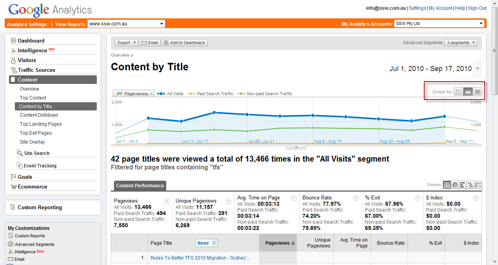
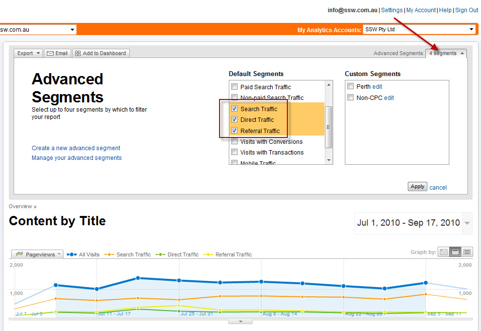
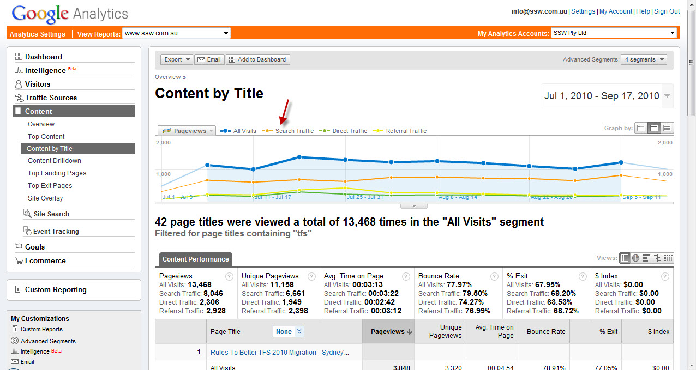
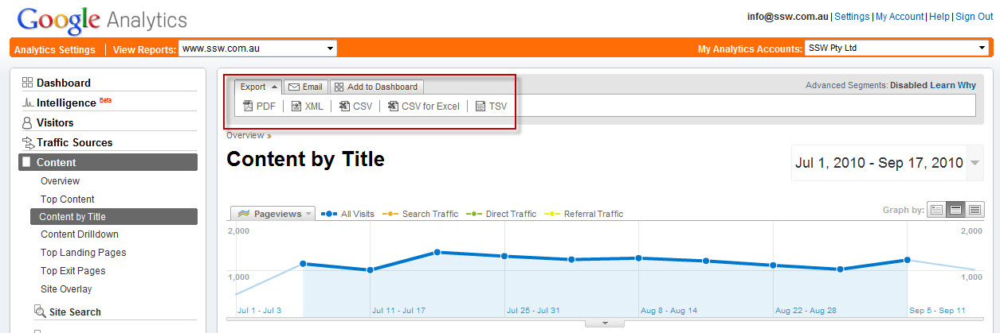
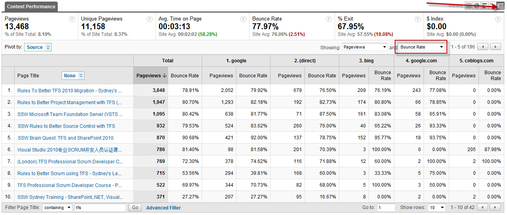
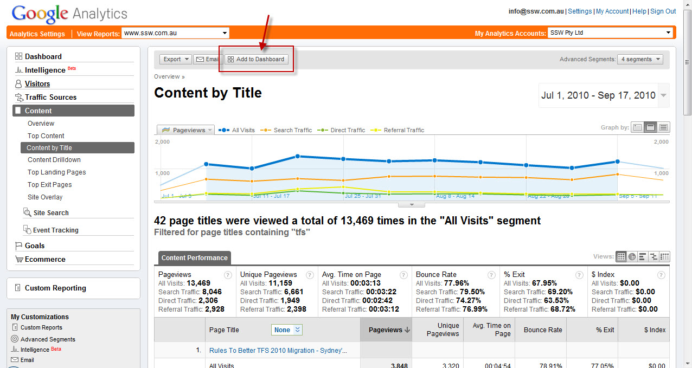
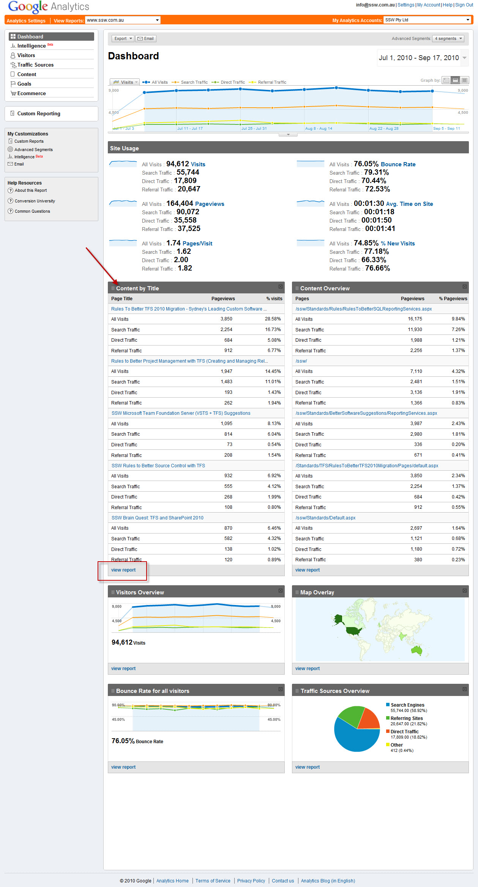

Keeping on top of your web site analytics can be daunting given the vast number of reports that are available in Google Analytics.  
<!--endintro-->

1. ## Content by Title
    Using the Content by Title report is an excellent way to view the improvement in pages that have been created for specific keyword terms.
         
         <strong>Figure: From the Content Section of the Analytics report pane, choose Content by Title</strong> 
2. ## Setting Date Ranges
    Choose the date range you want to view (eg 12 months)
3. ## Filter By Key Term
    Filter the report by the keyword term you are interested in viewing (eg TFS or SQL Server or SharePoint, etc). This assumes that you have used these keyword terms in the titles of the pages (see [Rules To Better Google Rankings](http://www.ssw.com.au/ssw/Standards/Rules/RulestoBetterGoogleRankings.aspx) for more details on best practices for increasing your Google presence).
         
         <strong>Figure: we have filtered by the term ‘tfs’.</strong>     The overall trend of your pageviews should be increasing.
4. ## View by Day, Week and Month Trends
         
         <strong>Figure: Use the ‘Graph By’ options to show trends for Weeks and Monthly visits</strong> 
5. ## View Segments
         
         <strong>Figure: Add Segments to compare your traffic sources including Search, Direct and Referral traffic. You can also compare with paid search traffic (if you are using AdWords to drive traffic).</strong>          
         <strong>Figure: The main segments to keep an eye on are the  <b>Search Traffic</b> and  <b>Referral Traffic</b> numbers – ideally both should be increasing.</strong>          
         <strong>Figure: You can export the report to PDF and Excel, or email it to your boss. Or, print the report and stick on your company noticeboard in a prominent position. 
</strong>          
         <strong>Figure: You can also view the sources of the traffic to see which sites are sending you traffic by clicking on the Pivot View.</strong>          
         <strong>Figure: You can also show bounce rate by including it in the second dropdown. Other metrics include Average Time on Page and Exit rate.</strong> 
6. ## Add To Dashboard
         
         <strong>Figure: Add the Report to your Dashboard</strong>          
         <strong>Figure: Now the report will be available from the Dashboard to check regularly. Click the ‘view report’ link to drill into the details of the above.</strong>
