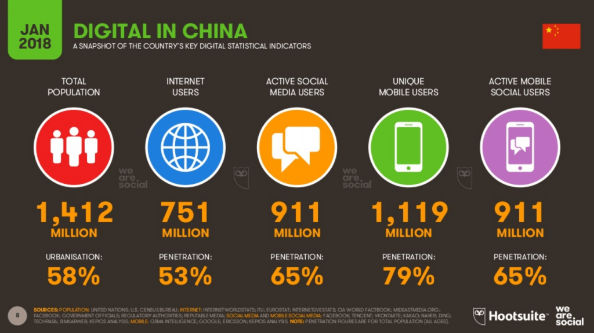
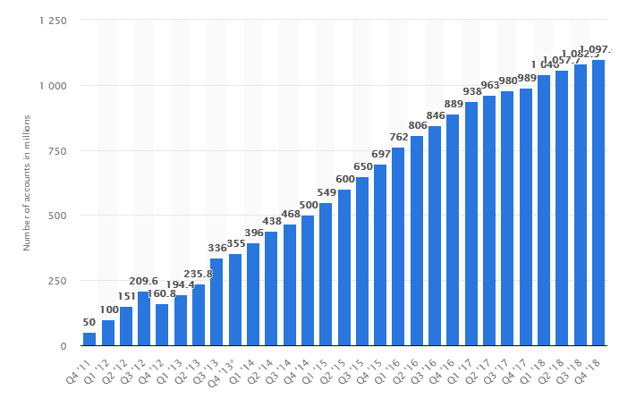
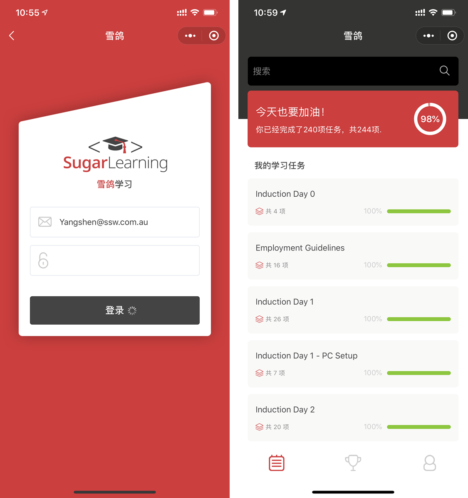
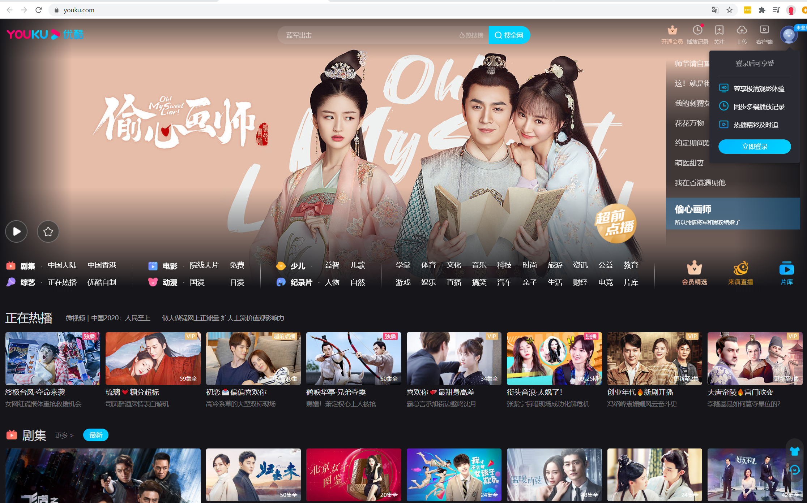
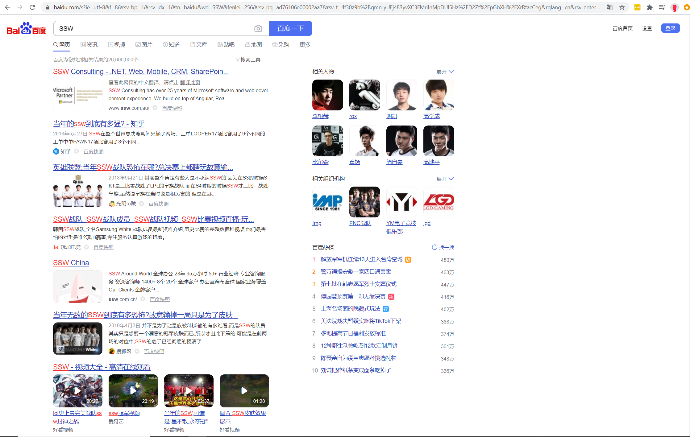
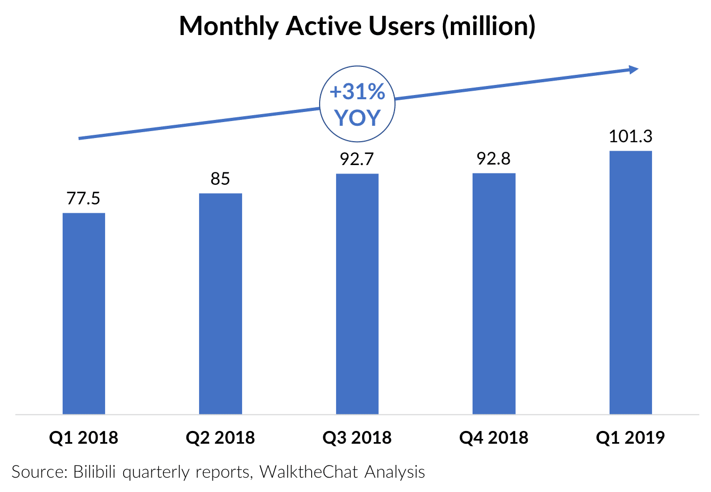
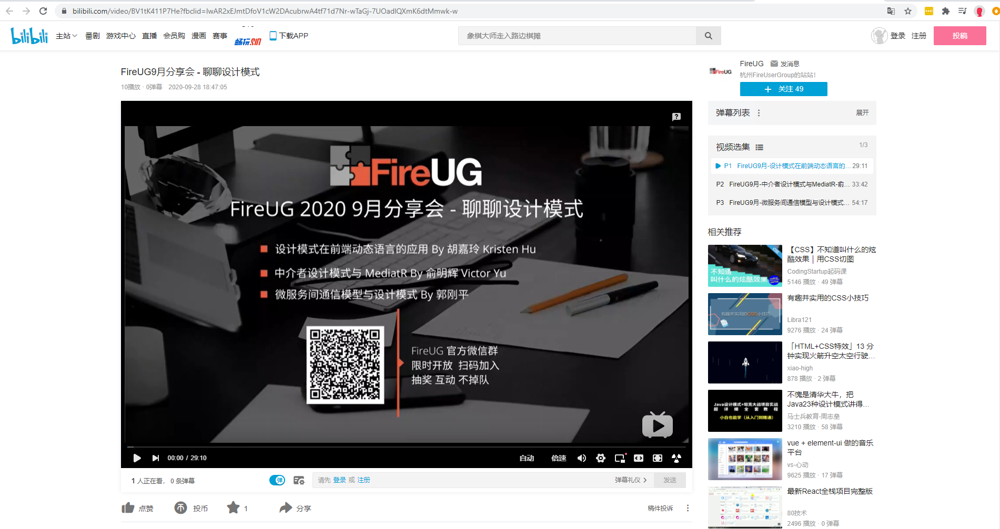

The biggest mistake most western companies make when embarking on a business journey in China, is assuming that their current Social Media strategies will work over there.

China is different. There are different rules, platforms and of course, they have a government controlled firewall that blocks many western platforms your are familiar with, like Facebook, Twitter, and YouTube. \*Uh oh\*. That's right - none of the platforms you currently use everyday now work in China, you need a new plan.

<!--endintro-->

China has a huge amount of social media users, there are over 911 million active users - which is huge! In comparison, the U.S.A only have 207 million users, a small fraction compared to China. It is a huge opportunity for market growth, particularly for app owners who would like to expand their product to millions of users.

There is one big problem - the digital market in China also has hundreds of social media platform options. With no big platforms like Google, Facebook, and Twitter to focus on, so who do you target? The biggest platforms in China are WeChat (instant messaging and social media), Baidu (similar to Google search engine), Weibo (like Facebook and Twitter combined), Youku (similar to YouTube)… but there are others that are now trending.

However while we often try to draw comparisons with these platforms with their western counterparts, be aware that even though these Chinese platforms may take the basic concepts and functions from the West, they are equipped with much more diverse features.

Do you know the best platforms to use in China? Here is a list of our top 5:

### 1. WeChat (The Chinese Super App)

WeChat started as an instant messaging app similar to WhatsApp but has morphed into a ‘super app’ that now allows you to do just about anything! Users can perform a wide variety of activities such as making transactions, ordering food, booking movie tickets, calling a taxi, even playing games. It now has more than 1 billion active users.

Why you should consider using it:

* 68M videos are uploaded every day
* WeChat users send averagely 38 billion messages daily
* On average, users spend more than 66 minutes on WeChat daily.
* 60% of WeChat users open the app more than 10 times a day.
* By the end of 2019, the number of WeChat’s Official Accounts surpassed 20M.
* Flexible media – you can upload pictures, text, short videos, articles etc.

There are 4 types of Official  WeChat Accounts; “Subscription Accounts”, “Service Accounts", “Enterprise Accounts" and the “Mini Program”. Each of them has unique functions and uses, which are outlined in more detail on [creating a WeChat official account](/how-to-create-wechat-official-account).

### 2. Weibo (The Facebook of China)

Weibo is an social media platform where people go not only post, share and interact with each other, but also follow trends and see the news. This is the place for content to go viral and for Chinese Influences, known as KOLs, to build their online communities. Like Facebook Live, It has its own live stream platform which is often used for product promotion. Conveniently it also has E-commerce integration which mean that people can link their accounts to Alipay and purchase products with one click.

Why you should consider using it:

* Number of Weibo active users: 465M (2019)
* Number of daily users: 203M (2019)
* 50% increase in livestream sessions
* Q&A postings increased by 400% in 2018 compared to 2017
* 82 per cent of Weibo users shop online

### 3. Youku (The YouTube of China)

Often referred to as the YouTube of China, Youku is a video hosting service that is great for long-form videos. While there are popular short-form video platforms, like Tik Tok, Youku has remained the popular source of videos for people who want to gain greater knowledge in a subject, or to watch the news.

Why you should consider using it:

* 580M active users, who on average visit it daily 39 times.
* Over 1 billion video views per day
* On average people stay for around 4 minutes per video
* It will help you reach a wider audience and build a reputation as a source of knowledge
* It’s great for brand awareness via video content
* It can be used to drive traffic to your website and increase sales

### 4. Baidu (The Google Search of China)

93% of online experiences in the Western world begin with a Google Search. In China it is search engine Baidu that dominates with 90% of online search starting there. That’s \*billions\* of searches per month!

Why you should use it:

* It’s cheaper than Google! Strangely it is on average 25-50% cheaper for the same keywords on Google\*.
* It has 665 million active monthly users
* Reaches 1 billion mobile devises
* The Baidu app has 200 million daily users
* Rapidly growing with new users every day

_\* The Cost per click is lower but be warned - Baidu does have some strict payment terms, requiring an initial deposit of at least RMB 20,000 (USD $2,952) if you are a foreign company. But the overall cost of your campaign should be comparatively lower._

### 5. Bilibili (Up & coming alternate to Youku)

We all know that the best marketers are using video to sell their products and directly engage their audience online. Brands should not overlook the usefulness of branded online video for their audience. Similar to how YouTube experiences huge popularity in the West, China’s video platforms such as Youku and iQiyi are successful with the local Chinese audience. But one live streaming platform that is often overlooked is the video-sharing platform Bilibili.

What started as a China's largest Anime streaming platform, it has grown to be one of the most popular video sharing platforms for China’s Millennials and Generation Z with over 100 million monthly active users, where users can view, submit, and add commentary to videos.

Bilibili also recently launched a premium membership enabling access to special shows, e-commerce deals, and HQ video streaming. If you want to increase your long-term success in China, it is important to penetrate Gen-Z consumers who have an expanding purchasing power. Bilibili, uses mini programs (multi-page application containing a complete application feature), livestreaming, and e-commerce to benefit brands looking to market to younger consumers.

According to Bilibili's annual report to investors, their top 5 most watched video categories are:

1. Entertainment
2. Lifestyle
3. Gaming
4. Anime
5. Technology

Technology videos are now in the top 5 most watched category on Bilbili, and SSW China have discovered that Bilibili is a great platform to live stream and record our Fire User Group, with over 300 viewers joining us online to share our technology talks.

Why you should use it:

* Young, active audience with a keen interest in technology
* Over 130 million active users
* 101 million monthly users
* Continuous viewer growth
* Video streaming & mini programs for e-commerce (E.g. [“Intermediaries design patterns and MediatR” by Victor Yu, SSW China](https://www.bilibili.com/video/BV1tK411P7He?p=2))

