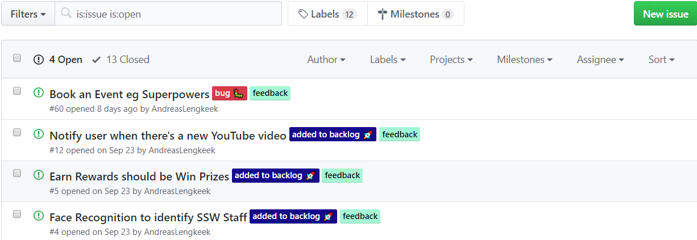

It is important that you, especially a developer, knows how to use labels for GitHub issues when using an open source project on GitHub, as it would help compact issues and make the issue management workflow more efficient. Essentially, having such a predictable workflow will let the community feel professional.

<!--endintro-->

Every new repository comes in with some default labels out of the box that you could use to label your issues to help create a standard workflow in a repository. A list of the default labels and their general uses can be found here: <https://docs.github.com/en/enterprise-server@3.1/issues/using-labels-and-milestones-to-track-work/managing-labels>.

Depend on projects, there often need to be new labels created on top of the default labels. For instance, when you are using an internal project management solution (such as Azure DevOps) for an open source project, a new label "added to backlog" is created and applied to applicable issues specifically for demonstrating that an issue has been added to the Azure DevOps backlog and is being worked on for the community. This way you can give the community an understanding of the current goals of the project and a higher feeling of interactivity with your development team.

::: bad
Bad Example: It is hard to understand what issues are being worked on\
:::

::: good
Good Example: It is very simple to understand if an issue has received attention\
:::