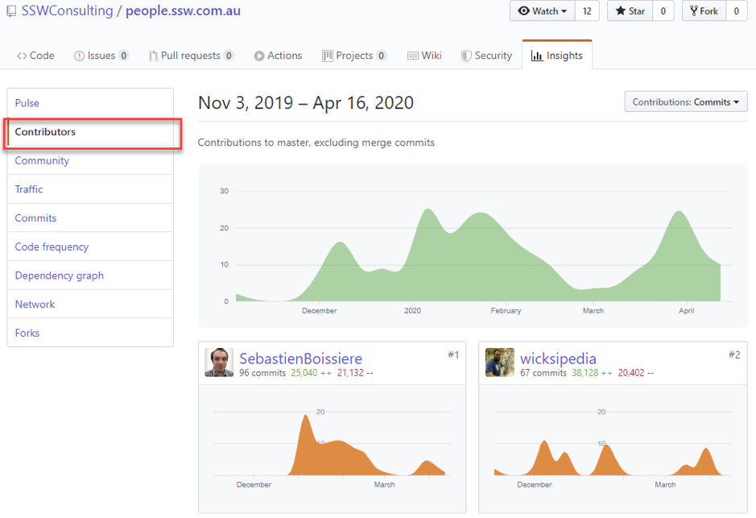

When you have a public project in GitHub you have some graphs available that give you some statistics helping you to understand who is using your project and why they are using it. These graphs can be found under the Insights tab.

<!--endintro-->
<dl class="image">&lt;dt&gt;&lt;/dt&gt;<dd>Figure: Under your project name, click Insights</dd></dl>
Read more about the project’s graphs: https://help.github.com/en/github/visualizing-repository-data-with-graphs/about-repository-graphs

Some project graphs available:

### Pulse Graph

<dl class="image">&lt;dt&gt;&lt;/dt&gt;<dd>Figure: Pulse graph shows a summary of the project activity</dd></dl>
Read more about  **Pulse Graph** :     https://help.github.com/en/github/visualizing-repository-data-with-graphs/viewing-a-summary-of-repository-activity

### Contributors Graph

<dl class="image">&lt;dt&gt;&lt;/dt&gt;<dd>Figure: Contributors graphs show the top 100 contributors to the project</dd></dl>
Read more about  **Contributors Graph** :     https://help.github.com/en/github/visualizing-repository-data-with-graphs/viewing-a-projects-contributors

### Traffic Graph

<dl class="image">&lt;dt&gt;&lt;/dt&gt;<dd>Figure: Traffic graphs show the project’s traffic, including clones, visitors in the past 14 days, referring sites and popular content to anyone with push access to the project </dd></dl>
Read more about  **Traffic Graph** :     https://help.github.com/en/github/visualizing-repository-data-with-graphs/viewing-traffic-to-a-repository
