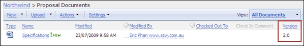

This is how you should work with **document versions**:

<!--endintro-->

1. Make sure your document library is configured to use versioning.   
   **Tip:** You can configure this in **Settings | Versioning Settings**
2. Make sure you are showing the version column in your document view.  
   

3. Whenever you edit the document and check it in, SharePoint will automatically increase the version number. If you need to send this document to a client then it is important to:
    1. Save the file locally by selecting **Send To | Download a Copy**    

    2. Add the version to the end of the filename e.g. Specifications\_v2.0.docx
    3. Then email it to the client.
    4. We do this so that we can track what version of the document was sent to the client. 
   **Tip:** If you are not working with SharePoint then we recommend you [include version numbers in your file names](/show-version-numbers/).
