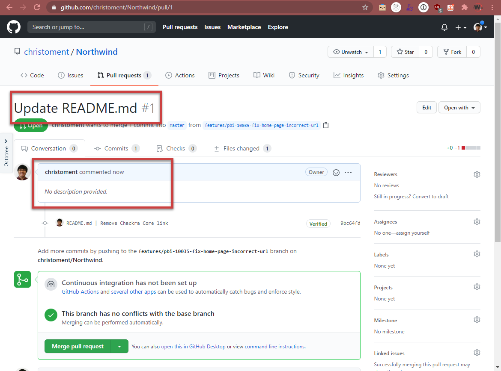
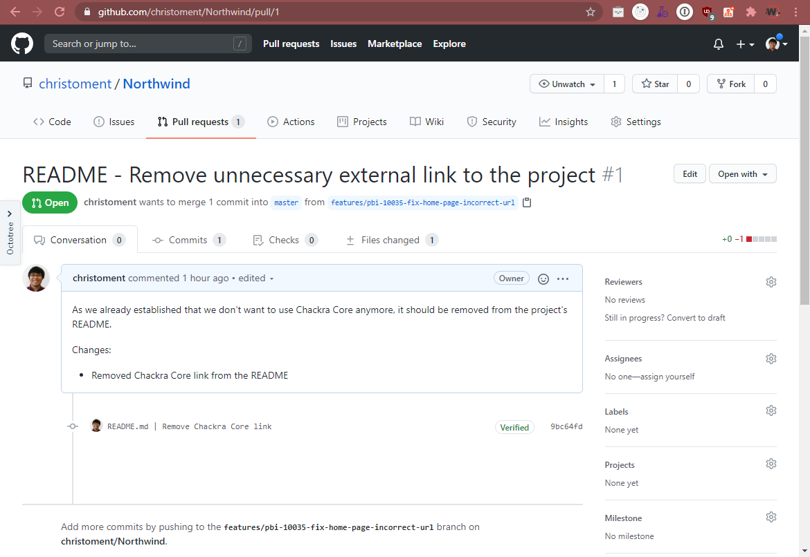
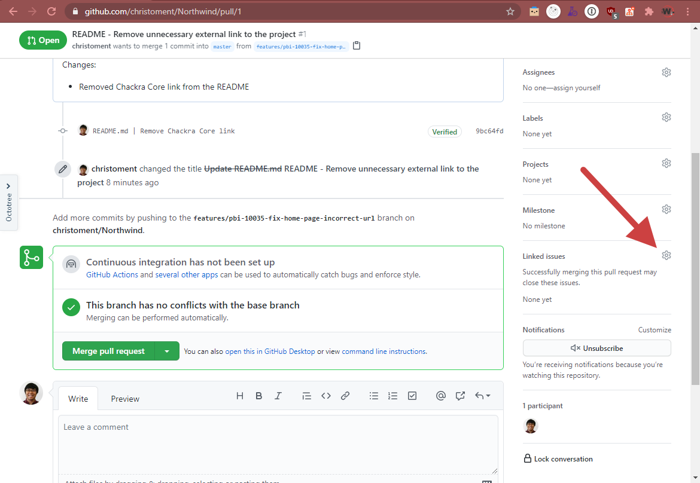
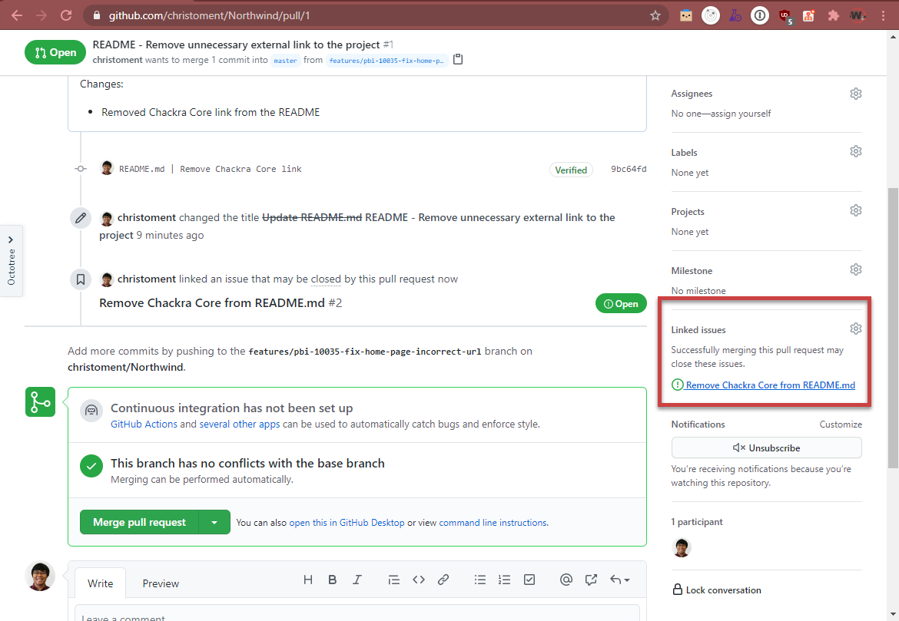

​As a software developer, it is very common to see a pull request. The quality of a pull request can vary - sometimes we have to deal with a cryptic pull request and sometimes we find a very well written pull request.

​​Having a great pull request message can help your peers to understand your pull request quickly so they can review your pull request faster and also give you better suggestions. 

 <excerpt class='endintro'></excerpt> 

While the pull request itself is valid and may offer a high value, you need to spend a bit of time to understand what is the context of this pull request and what does it change. Doing this step can take your time easily from 1 minute (if you just recently touched the code) to more than 10 minutes (if it has been a long time since you worked on it - or even if you have never touched the code). 

Writing a great pull request can help your peers to understand your code better and therefore, they can give you better insights (or faster review turnaround time, that's great!). 

There are a couple of things that you can do to improve your pull request: 
<ol><li>Write a concise and self-explanatory title </li><li>Write a concise and descriptive body </li><li>Link the pull request to the associated issues / PBIs </li></ol>
 
   
       
<h3 class="ssw15-rteElement-H3">1. ​​​​​Write a concise and self-explanatory title </h3>
The key to writing a concise pull request is to base the pull request itself on a PBI / issue. 

Example PBI title: Product Backlog Item 100359: "Desktop App | Exporting occasionally failed" 

​Pull request title: "Fix exporting" 
<dd class="ssw15-rteElement-FigureBad">​Bad example - Pull request title does not tell what issues have been fixed and how </dd>
​​​Pull request title: "Fix desktop app exporting - prevent database concurrent access while exporting" 
<dd class="ssw15-rteElement-FigureGood">Good example - ​Pull request title briefly describe the fix that it has </dd>
The important information in the title are: 

<ol><li>What the pull request will do </li><li>How the pull request achieved it </li></ol>

Having the "What" information allows the reviewers to quickly understand what this is about while having the "How" can help the reviewer to quickly understand how your pull request solved the problem. Sometimes we might want to put the "How" in the pull request body if it is too long or hard to explain in one sentence. 
<h3 class="ssw15-rteElement-H3">2. ​​​Write a concise and descriptive body </h3>
Pull request body is a medium for the developer to tell the reviewers what the pull request is about. Things that need to be kept in mind before writing a pull request body: 

<ol><li>What the pull request is about and why did you raise a pull request </li><li>How did the pull request will achieve the feature/fix the bug/other goals it may have </li><li>(Optional) Put a screenshot if it will help the reviewer to understand the changes (e.g. front-end cosmetic change) </li><li>(Optional) What do you want the reviewers to do - this can be approvals (most of the case) or looking to get more feedback on a piece of code in the pull request.​ </li></ol><dl class="badImage"><dt>​</dt>
   <dd>​Bad example - Pull request with vague title and no description </dd></dl><dl class="goodImage"><dt>
       
   </dt><dd>​Good ​example - Pull request with a good title and descriptive body​​​ </dd></dl> ​There is also a well-known pull request semantic like <a href="https://www.conventionalcommits.org/en/v1.0.0-beta.2/">Conventional Commits</a> on how to write a pull request body, but we can still have a great pull request without using such semantic.  
<h3 class="ssw15-rteElement-H3">3. ​​Link the pull request to the associated issues / PBIs </h3>

Since we already have a great title and body, the last thing to do is to associate this pull request to the related PBIs or issues. 

Linking an issue to a pull request can serve as documentation on which development work that was done on a specific PBI/issue. It may help the team in the future to debug when and which changes were introduced and what was the original specification of that piece of work. 
<dl class="image"><dt>
       
   </dt><dd>​Figure: Linking a pull request to the related issue </dd></dl><dl class="image"><dt>
       
   </dt><dd>​Figure: A pull request is now associated with the related ​issue </dd></dl>​ 

