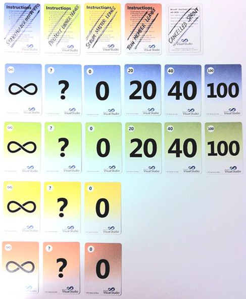
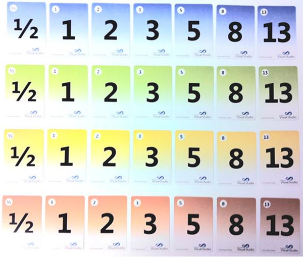

Exercise – Click Click Scrum

This exercise uses the VS2010 planning poker deck of cards & TFS

<!--endintro-->

# Separate out the cards

Separate out these as Chance Cards

Separate out these as Point Cards

# Set Timeboxes

**Sprint Planning (What):** 20 minutes
**Sprint Planning (How):** 20 minutes
**Each Day:** 10 minutes ( x 9 days = 90 minutes)
**Review:** 20 minutes
**Retro:** 20 minutes

**Total for 1 complete Sprint:** 170 minutes (~3 hours)

# Sprint Planning Meeting (What)

1. The trainer acts as PO and gives PBIs & prioritises them
2. Students clarify the requirements of the PBIs (Details, Acceptance Criteria)
3. Students do Planning Poker to Estimate
4. Students break PBIs into tasks
5. Students put estimates on each task (typical times for work in a day e.g 4 hours, 8 hours)

# Each Day in the sprint

1. Get the students “Click-Click” their fingers instead of doing actual coding
2. The trainer deals one or two cards from the Chance Cards
3. The trainer looks up the meaning of the cards (see table below) and the trainer makes up a suitable PBI that fits the card and the work the students are doing
4. The students add or change work items based on the scenario of the Chance cards
5. The team reduces the remaining hours on their assigned tasks, with the assumption that each student works 8 hours
6. Do the Daily Scrum (describing their day based on the work they just updated in TFS)

NOTE: It is OK to really code rather than use “Click-Click” development as long as TFS is updated.

# The Review Meeting

The PO reviews the work of the team (Note: if all the work was “Click-Click” then review the TFS work items to check that they are entered OK).

# The Retro

Students and PO do a standard Scrum retro for the exercise.

# Meaning of the Chance Cards

| **∞** | Impediment |
| --- | --- |
|  <ul>                <li>Draw a point card </li>                 <li>Add the value to the remaining hours of a task</li>                 <li>Record the impediment</li>             </ul> e.g.  DBA will not give access to the database. |
| **?** | Clarification |
|  <ul>                <li>Draw a point card </li>                 <li>Add a new task</li>                 <li>Set the remaining hours of a task to the value</li>             </ul> e.g.  The error message should change from “User Error” to “The process could not be completed, please check the Url value provided for the webservice and try    again”. |
| **0** | Bug |
|  <ul>                <li>Draw a point card </li>                 <li>Create a bug</li>                 <li>Add a task to the bug</li>                 <li>Set the remaining hours on the task to the value</li>             </ul> e.g. One of the build scripts fails on the build server, but works on a local dev machine. |
| **20** | Bubble |
|  <ul>                <li>Halve the remaining hours on a task </li>             </ul> e.g. The data access layer supports the validation framework so as that was already implemented the effort expected has decreased. |
| **40** | Spike |
|  <ul>                <li>Draw a point card </li>                 <li>Create a new PBI </li>                 <li>Set the PBI points to the value</li>             </ul> e.g. The current implementation may not support real-time display of information with the    performance expected by users – investigate   |
| **100** | Task blowout |
|  <ul>                <li>Double the remaining hours on a task </li>             </ul> e.g. Multiple field data validation was supported in the application but when it was implemented for this work it failed all validations calls and it took ages to find the    settings in web.config were wrong. |
| **Cancelled Sprint** | The PO cancels the sprint |
|  <ul>                <li>Cancel all tasks</li>                 <li>Recycle the PBIs to the Product Backlog </li>             </ul> |
| **Team Member               Leaves** | The Team is missing a Team Member |
|  <ul>                <li>Reduce the hours the team works by 8 hours </li>             </ul> |
| **Scrum Master               Leaves** | The Team is missing the  Scrum Master |
|  <ul>                <li>The team handles the missing SM</li>             </ul> |
| **Product Owner               Leaves** | The Product Owner is missing |
|  <ul>                <li>The team handles the missing PO</li>             </ul> |
| **Stakeholder Interferes** | Stakeholders are contacting the Team to change priorities and requirements |
|  <ul>                <li>The team handles the Stakeholders </li>             </ul> |
