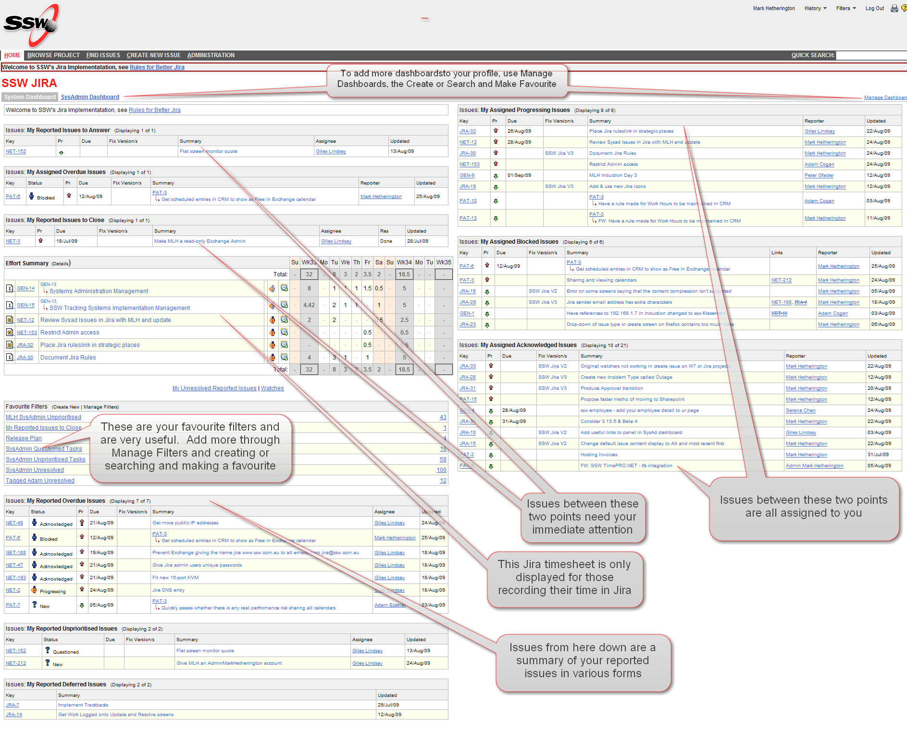
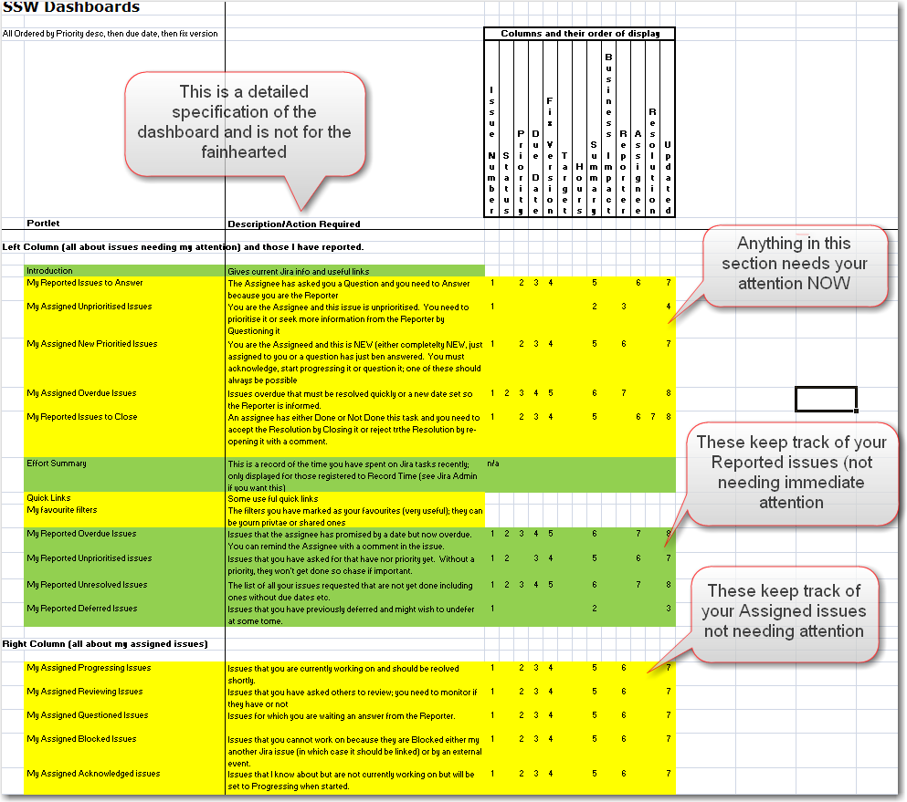

The<a class="ms-rteCustom-External" href="/Pages/SystemDashboard.aspx" shape="rect">System</a> Dashboard  is the Default Dashboard that is displayed as the Home Page when you enter Jira; it is all about YOU.  It contains a summary of the issues that you should be dealing with immediately, those issues you are working on and have queued to work on and those issues that you have requested from others and are still outstanding. 
​
 <excerpt class='endintro'></excerpt> 

  
The dashboard consists of a number of portlets configured by the Jira Administrator so they can be changed.  You can also take a copy of the System Dashboard and modify it, name it and then share it with others.  See the page on the SysAdmin dashboard.  Portlets often use Filters to display their contents.  Filters are also user-definable and shareable.  You can search on dashboards and filters and put any of them into your favourites. 
 
The System Dashbaord has two columns and three main "areas"; these areas only appear if they are relvant to you as a user and have have current content.

<ol>
    <li>Issues requiring your immediate attention </li>
    <li>Reported Issues </li>
    <li>Assigned Issues </li>
</ol>

It will also show your Favourite Filters which are very useful. 
 
System Dashboard example: 
 
 
The specification of the dashboard is: 
 

