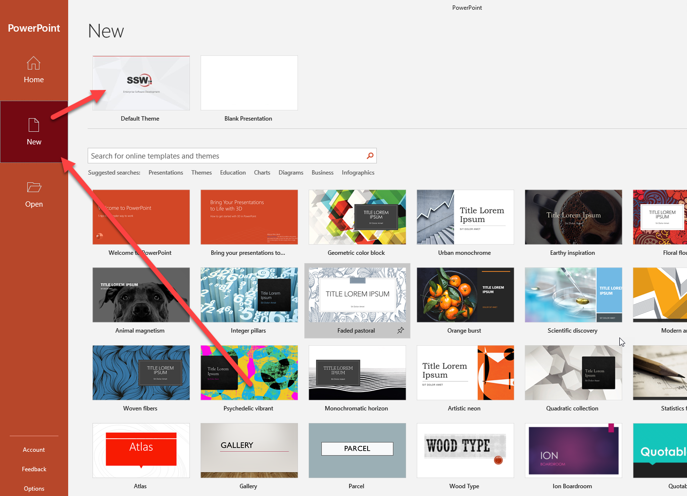

PowerPoint templates are designed to engage your audience visually and save you time. When you start creating a new presentation file, always make sure you use a template. 

 <excerpt class='endintro'></excerpt> 

  <dl>
    </dl>
Pros of using a template are: 

<ol><li>Consistency of use for others at your company to work on it</li><li>Consistency of look on intro and finish slides</li><li>Consistency of look footer on each slide</li><li>Consistency of general styling</li><li>It helps with the process of getting a ‘Designer Test Pass’</li></ol>
<dl><dt> </dt>
    <dd class="ms-rteCustom-FigureBad">Figure: Bad Example - Not using the corporate template (in this case not SSW) </dd>
</dl>
<dl>
    <dt> </dt>
    <dd class="ms-rteCustom-FigureGood">Figure: Good Example - That's a mighty fine looking template you got there </dd><dt> </dt>
</dl>

<b>How to pick the template:</b> In newer versions of PowerPoint, it is necessary to add your custom template to: C:\Users\<UserName>\Documents\Custom Office Templates\

They will then appear in the PowerPoint list when creating a new presentation. You can also find a more in-depth guide on how to <a href="https://support.microsoft.com/en-us/office/create-and-save-a-powerpoint-template-ee4429ad-2a74-4100-82f7-50f8169c8aca">create PowerPoint templates</a> and how to <a href="https://support.microsoft.com/en-us/office/use-a-personal-template-to-create-a-new-powerpoint-presentation-71262c90-1447-4109-90f3-eb84f9d06c98">use a personal template.</a> 
<dd class="ssw15-rteElement-FigureGood">Figure: Good Example - Your custom template appears in PowerPoint</dd><dt> </dt><dt><strong>How to check if the template is being used?</strong></dt><dt>There is no way to tell which template your presentation is using. The workaround is to add a hidden slide at the end with a list of the version changes e.g. version number, date, description. </dt>
<dl>
</dl>

