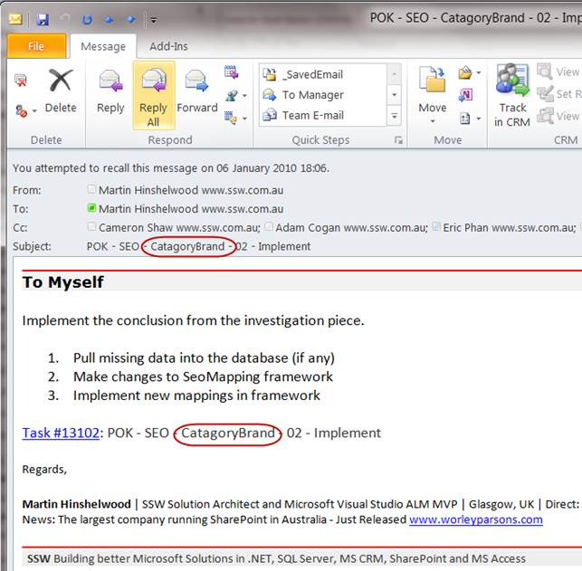
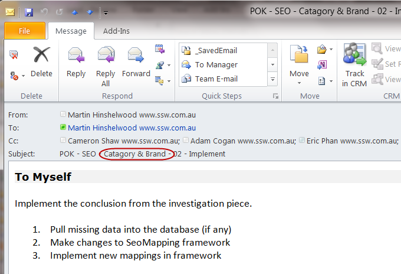

You should never use concatenated words in the subject or body of an email, no matter how much better you think it is. You are misguided, always use a “space”, “&” or “and” as your spell checker will then catch mistakes. 
 <excerpt class='endintro'></excerpt> 

  

Figure: Bad Example, “CatagoryBrand” will not be spell checked and the mistake overlooked 

 
Figure: Good example, spellchecker can check all words for correctness.

