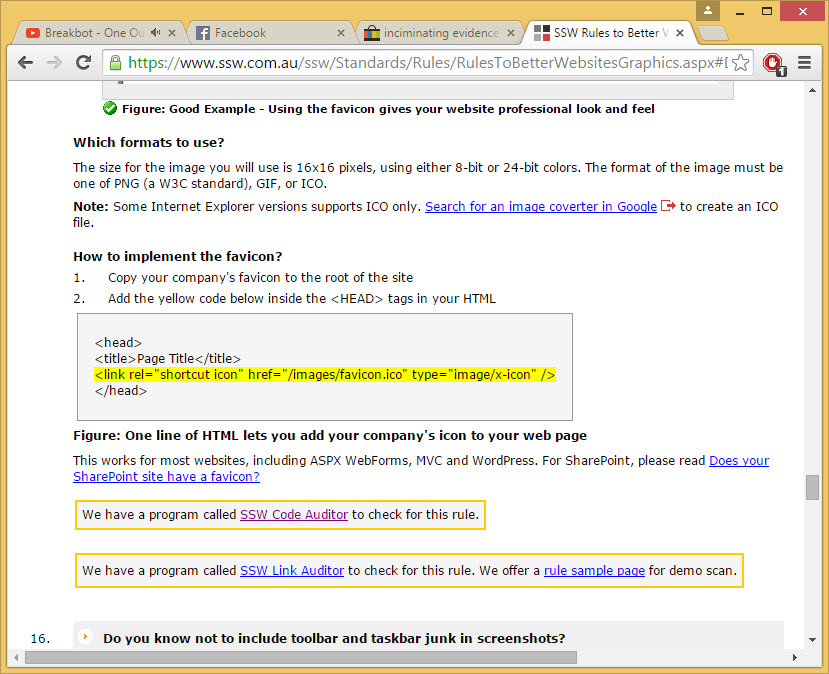
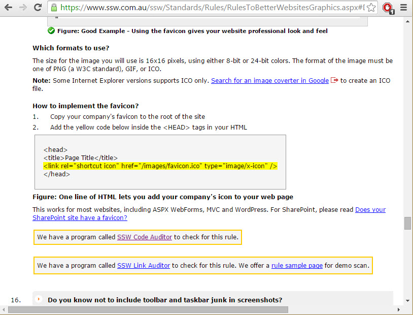
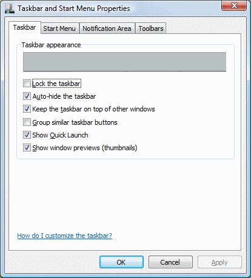

Screenshots are a very important part of websites these days. Be careful to avoid unnecessary toolbars and taskbars in screenshots.

<!--endintro-->

::: bad  
  
:::

::: good  
  
:::

Tips:

* Use a region screen shot if appropriate (however the URL is generally helpful in most browser screenshots)
* Go full screen
* Always have the 'Auto-hide the taskbar' option checked

::: good  
  
:::
