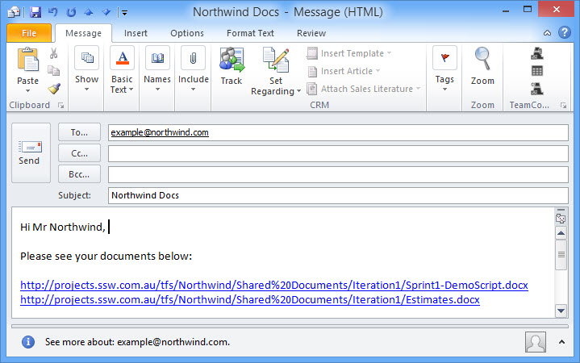

It's better to use links to a portal or document store instead of having attachments in your emails.

If you're sending to a fellow employee, use a link to a document store on your intranet (e.g. intranet.northwind.com/SharedDocuments)

If you're sending to a client, it would be a link to a document store on their project portal. (e.g. projects.northwind.com/SharedDocuments)

<!--endintro-->

::: bad  
  
:::

::: bad  
  
:::

**Tip:** If you're using SharePoint, then an even better way to do this is to use a tool like OnePlaceMail to insert a link from SharePoint

::: good  
  
:::

Using the Document ID Feature in SharePoint will help minimise broken links under the following scenarios:

1. Company Restructures / SharePoint restructures
2. Records Management – when items are moved to the Record Centre

::: good  
  
:::

If you are using a shared DropBox, then put in a reference like so:

::: greybox
I've moved the file to our DropBox at: `SSW_Designers/Project – FireBootCamp/Admin/FireBootCamp-USA-Ultra-Advert.pptx`
:::

