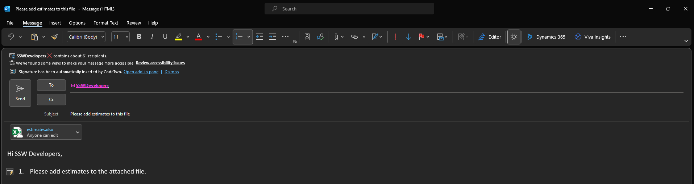

How you work with attachments should change depending on who you are emailing. 

If you're sending to a fellow employee, use a link to a document store on your intranet (E.g.: `intranet.northwind.com/SharedDocuments`)

If you're sending to a client, either get them to share a publically available link or attach the files to the email (recommended). E.g.: For a Spec Review. 

<!--endintro-->

### Internal Docs

When sharing documents it's best to keep the work alive and the best way to do that is to have it hosted in one place where all working parties can access it. Using SharePoint will also help minimize broken links.

::: bad

:::

::: good

:::

### External Docs

When communicating with external contacts, it's often easier to attach the file than share a link due to permission issues. This also allows them to share the document internally and always have access to the copy.

::: bad

:::

::: good

:::

#### Benefits

✅ Clients like attachments 

✅ They can forward it to whoever they want

✅ There is a paper trail of changes and feedback that they can share internally on their end.
